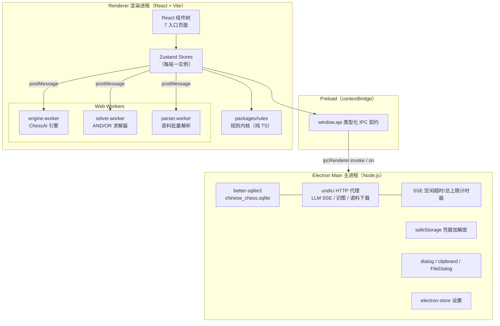
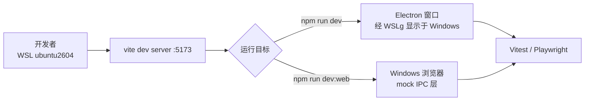
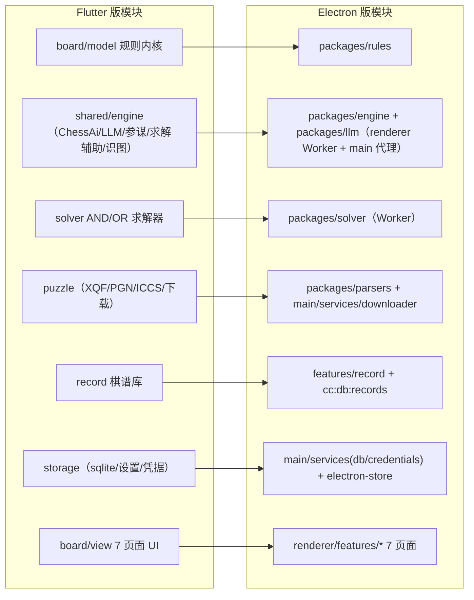

# 00 总体架构与技术选型

> ChineseChessUltra Electron 版总体设计。源项目：`/home/ssy/proj/ChineseChessUltra`（Flutter，WSL）。
> 本文档定义技术选型、进程模型、IPC 协议、目录结构与开发环境工作流。

---

## 1. 技术选型

### 1.1 选型矩阵

| 决策项 | 采纳方案 | 候选与弃用理由 |
|---|---|---|
| 桌面框架 | **Electron ≥ 30** | Tauri（WebView 一致性差、Linux 上依赖 webkitgtk 行为差异大，弃）；NW.js（生态萎缩，弃） |
| 渲染层框架 | **React 18 + TypeScript + Vite** | Vue 3（团队熟悉度与生态映射不如 React，弃）；原生 DOM+轻量库（棋盘动画/虚拟列表/弹窗全手写，工作量过大，弃） |
| 状态管理 | **Zustand + 每局一实例** | Redux Toolkit（样板代码多，弃）；MobX（装饰器依赖，弃）。对齐 Flutter 版 Riverpod 的"轻量 store"心智，但**每局一个实例**（见 07 文档 §6） |
| 引擎/求解器实现语言 | **TypeScript，跑渲染进程 Web Worker** | Rust napi-rs（性能最好但引入跨平台编译工具链，首发弃，接口预留替换）；C++→WASM（调试体验最差，弃） |
| HTTP 客户端 | **主进程 undici**（Node 20 内置） | 渲染进程 fetch（Chromium CORS 会拦截第三方 LLM 端点，弃）；axios（对 SSE 流式支持差，弃） |
| 数据库 | **better-sqlite3（主进程）** | sql.js（WASM，性能差且要手工持久化，弃）；IndexedDB（无 SQL、主进程不可访问，弃） |
| 设置存储 | **electron-store（JSON 文件）** | 对应 Flutter shared_preferences |
| 凭据存储 | **Electron safeStorage** | 对应 flutter_secure_storage（OS 级加密：Windows DPAPI / Linux libsecret / macOS Keychain） |
| 测试 | **Vitest + Playwright** | — |
| 打包 | **electron-builder** | — |

选型结论已记入 `decision_log.md`（DR-002/003/004），各含弃用理由。

### 1.2 与 Flutter 版的技术映射总表

| Flutter/Dart 现状 | Electron 版对应 | 说明 |
|---|---|---|
| 规则引擎（纯 Dart，`lib/features/board/model/`） | 纯 TS 模块 `packages/rules`（渲染进程与 Worker 共用） | 零框架依赖，1:1 移植 |
| `ChessAi`（Isolate 运行） | `engine.worker.ts`（Web Worker） | 见 03 文档 |
| `EndgameSolver`（Isolate 运行） | `solver.worker.ts`（Web Worker） | 见 04 文档 |
| `LlmMoveSource`（http 包直连） | 主进程 undici 代理 + IPC 事件流 | 见 05 文档 §3 |
| `sqlite3`（sqlite3 包直连） | better-sqlite3（主进程） | 表结构与 SQL 原样保留 |
| `flutter_secure_storage` | Electron safeStorage（加密后落 userData 目录 JSON） | 三槽位语义不变 |
| `shared_preferences` | electron-store | key 原样保留 |
| Riverpod 全局单例 VM | Zustand **每局一实例** | 消除原版切页残留缺陷 |
| `Isolate.run` / `Isolate.spawn` | `new Worker()`（渲染进程 Web Worker） | 结构化克隆传参 |
| FilePicker / Clipboard / share | Electron dialog / clipboard / writeText | — |
| GitHub Actions 四平台构建 | GitHub Actions + electron-builder 四平台构建 | — |

---

## 2. 进程模型



**职责划分（铁律）：**

| 层 | 职责 | 禁止事项 |
|---|---|---|
| main | SQLite 读写、对外 HTTP（LLM/识图/下载）、凭据加解密、系统对话框、SSE 计时器 | 不碰任何 UI 逻辑 |
| preload | 仅暴露类型化 API，不做业务 | 不泄露 `ipcRenderer` 原始对象 |
| renderer | UI、规则计算、状态、Worker 调度 | **不发对外网络请求**（CORS/凭据隔离）、不触碰 Node API |
| Worker | CPU 密集计算（搜索/求解/批量解析） | 不访问 DOM、不做 IO |

---

## 3. IPC 协议规范

### 3.1 通道清单

所有通道前缀 `cc:`。请求-响应型用 `ipcRenderer.invoke`；事件流型用 `ipcRenderer.on`。

| 通道 | 方向 | 类型 | 载荷 | 对应 Flutter 实现 |
|---|---|---|---|---|
| `cc:llm:chat` | R→M | invoke + 事件流 | `{requestId, url, headers, body}` | `LlmMoveSource._chat` |
| `cc:llm:chunk` | M→R | 事件 | `{requestId, delta: {content?, reasoning?}}` | SSE `delta.content` |
| `cc:llm:done` / `cc:llm:error` | M→R | 事件 | `{requestId, text}` / `{requestId, message}` | 流结束/异常 |
| `cc:llm:cancel` | R→M | invoke | `{requestId}` | — （新增，替代 `_gameSeq`） |
| `cc:llm:testConnection` | R→M | invoke | `{config}` | `testConnection` |
| `cc:vision:readBoard` | R→M | invoke | `{config, imageBase64, mime}` | `VisionBoardReader.readBoard` |
| `cc:db:saveGame` / `loadLatest` / `deleteForMode` | R→M | invoke | `{mode, fen, moves}` 等 | `GameRepository` |
| `cc:db:records:*`（list/get/save/delete） | R→M | invoke | 棋谱 CRUD | `record_repository` |
| `cc:store:get/set` | R→M | invoke | `{key, value}` | shared_preferences |
| `cc:secure:get/set/delete` | R→M | invoke | `{slot, payload}` | `LlmConfigStore` 三槽位 |
| `cc:corpus:download` | R→M | invoke + 进度事件 | `{url, targetDir}` | `CorpusDownloader` |
| `cc:corpus:progress` | M→R | 事件 | `{requestId, received, total}` | `onProgress` |
| `cc:corpus:scan` | R→M | invoke | `{root}` | `CorpusRepository.scanCategories` |
| `cc:corpus:listEntries` | R→M | invoke | `{categoryPath, categoryName}` | `CorpusRepository.listXqfEntries` |
| `cc:corpus:readFiles` | R→M | invoke | `{paths[]}` → `[{path, bytes}]` | `File.readAsBytes`（Worker 前置读，M5） |
| `cc:corpus:pgnIndex` | R→M | invoke | `{path, maxGames?}` | `CorpusRepository.scanPgnIndex` |
| `cc:corpus:readPgnGame` | R→M | invoke | `{path, entry}` | `CorpusRepository.parsePgnGameAt`（读取部分） |
| `cc:corpus:pickDirectory` | R→M | invoke | — | FilePicker.getDirectoryPath |
| `cc:dialog:saveFile` / `readFile` | R→M | invoke | 导出 PGN / 导入棋谱 | FilePicker.saveFile / withData |
| `cc:clipboard:write` | R→M | invoke | `{text}` | Clipboard.setData |
| `cc:app:lifecycle` | M→R | 事件 | `{phase: 'before-quit'/'close'/'blur'}` | WidgetsBindingObserver |
| `cc:engine:*` / `cc:solver:*` / `cc:parser:*` | R↔W | **不经 IPC**，Worker postMessage | 见 03/04/06 文档 | Isolate.run |

### 3.2 requestId 取消规范（横切，替代 `_gameSeq` 代数机制）

Flutter 版用 `_gameSeq` 自增计数器在响应返回后判断"已作废"。Electron 版统一为：

1. 渲染层每次发起异步操作（LLM 调用 / 下载 / Worker 任务）生成 `requestId`（UUID）；
2. 页面切换/新局/悔棋时：向 main 发 `cc:llm:cancel`（main 里 AbortController.abort）+ `worker.terminate()` 或向 Worker 发 `cancel` 消息；
3. 迟到的响应按 `requestId` 匹配，不匹配即丢弃——**丢弃逻辑在渲染层 store 收口**，与 Flutter 版语义一致；
4. Worker 任务协议统一为：

```ts
// 请求
{ id: string; type: 'findBestMoveEx' | 'evaluateMove' | 'solve' | 'parseBatch' | 'cancel'; payload: ... }
// 响应
{ id: string; ok: boolean; result?: ...; error?: string; progress?: { done: number; total: number } }
```

---

## 4. 目录结构

```text
chinese_chess_electron/
├── design_docs/                 # 本设计文档
├── package.json                 # workspace 根
├── src/
│   ├── main/                    # 主进程（Node/TS）
│   │   ├── index.ts             # 窗口与生命周期
│   │   ├── ipc/                 # 各 cc:* 通道 handler（llm/db/store/secure/corpus/dialog）
│   │   ├── services/
│   │   │   ├── llm-proxy.ts     # undici SSE 代理 + 计时器
│   │   │   ├── vision.ts        # 视觉识图
│   │   │   ├── downloader.ts    # 语料下载（安全设计见 06）
│   │   │   ├── db.ts            # better-sqlite3 初始化与迁移
│   │   │   └── credentials.ts   # safeStorage 三槽位
│   │   └── preload/index.ts
│   ├── renderer/
│   │   ├── app/                 # React 入口、路由、主题
│   │   ├── features/
│   │   │   ├── board/           # 棋盘 UI（渲染/动画/交互）+ 对战页 ×5
│   │   │   ├── puzzle/          # 语料浏览 / 残局详情 / 演示
│   │   │   ├── record/          # 棋谱库 / 重放 / 导出
│   │   │   ├── solver/          # 求解器调用封装
│   │   │   ├── studio/          # 残局工作室
│   │   │   └── settings/        # 全局设置 / LLM 配置卡
│   │   ├── stores/              # Zustand（每局一实例）
│   │   ├── workers/
│   │   │   ├── engine.worker.ts
│   │   │   ├── solver.worker.ts
│   │   │   └── parser.worker.ts
│   │   └── ipc/client.ts        # window.api 封装 + requestId 管理
│   ├── packages/
│   │   ├── rules/               # 规则内核（纯 TS，无任何环境依赖；renderer/worker/node 三端共用）
│   │   ├── engine/              # ChessAi TS 移植（被 engine.worker 引用）
│   │   ├── solver/              # AND/OR 求解器（被 solver.worker 引用）
│   │   ├── llm/                 # Prompt 组装 / 解析器 / 参谋制编排（纯 TS，可单测）
│   │   ├── parsers/             # XQF / PGN / ICCS（纯 TS）
│   │   └── storage-schema/      # 存档 JSON Schema 与类型
│   └── shared/                  # 常量（配色等）、类型
├── test/                        # Vitest（镜像 Flutter test/ 的 39 文件结构）
└── e2e/                         # Playwright
```

**分层原则**：`packages/*` 全部为纯 TypeScript（无 DOM/Node 依赖），保证三处复用：渲染进程直接调用、Worker 内调用、Vitest/Node 侧对拍测试调用。

---

## 5. Electron 安全清单

| 项 | 配置 | 理由 |
|---|---|---|
| `contextIsolation` | `true`（默认） | preload 与渲染隔离 |
| `nodeIntegration` | `false` | 渲染进程不暴露 Node |
| `sandbox` | `true`（preload 仅用 contextBridge/ipcRenderer） | — |
| `webSecurity` | **保持开启** | 外部 HTTP 一律走主进程代理，渲染层无需绕过 CORS |
| API Key | 仅经 safeStorage 加密落盘；日志/异常消息/IPC 回显全部掩码（沿用 `maskedApiKey` 语义） | — |
| 下载器 | SSRF 防护 + zip-slip 防护（详见 06 文档 §5） | 对齐 Flutter 版安全实现 |
| CSP | 渲染页 `Content-Security-Policy: default-src 'self'; connect-src 'self'` | 渲染层禁直连外网 |

---

## 6. 开发环境工作流（WSL ubuntu2604）

- **代码位置**：`/home/ssy/proj/chinese_chess_electron`（ext4 原生，勿放 /mnt/*，否则 npm 性能下降 10 倍）。
- **GUI 运行**：Ubuntu 26.04 桌面环境支持 WSLg——`npm run dev`（electron-vite / vite + electron）可直接在 Windows 桌面弹出窗口。若 WSLg 不可用，退路：`vite dev` + Windows 浏览器打开 `http://localhost:5173`（Worker/规则层可测，IPC 通道用 mock 层替代）。
- **IPC mock 层**：`src/renderer/ipc/client.ts` 检测 `window.api` 缺失时切换到浏览器 mock 实现（LLM 用本地 mock SSE、DB 用内存实现），保证纯浏览器也能开发 UI。
- **依赖注意**：`better-sqlite3`/`electron` 需在 WSL 内安装与 rebuild；`electron-builder` 打 Linux/AppImage 在 WSL 内完成，打 Windows NSIS 需在 Windows 侧执行或 CI 托管（见 10 文档风险表）。
- **Node 版本**：Node 20 LTS（undici 内置 fetch/Stream）。



---

## 7. 架构总览图（模块映射）



---

## 附：不迁移清单（空壳桩）

| Flutter 文件 | 现状 | 处置 |
|---|---|---|
| `pikafish_bridge.dart` | 全 TODO，返回硬编码 'h3e3'，无引用 | 不迁移；README 中 Pikafish 相关章节随迁删除 |
| `engine_view_model.dart` | 全 TODO 桩，未被真实功能使用 | 不迁移 |
| `hint_strategy.dart` | 空接口桩 | 不迁移 |
| `board_page.dart` | 旧版主页，无路由入口 | 不迁移，仅参考其生命周期写法 |
| `puzzle_list_page.dart` | 遗留 Demo（3 条硬编码残局） | 标记可裁剪；其"文件导入"能力并入语料库页 |
