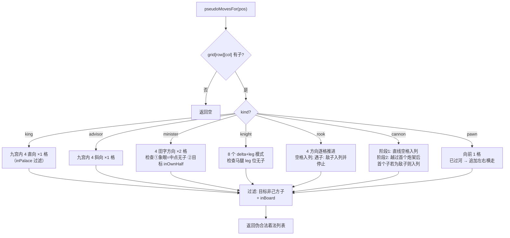
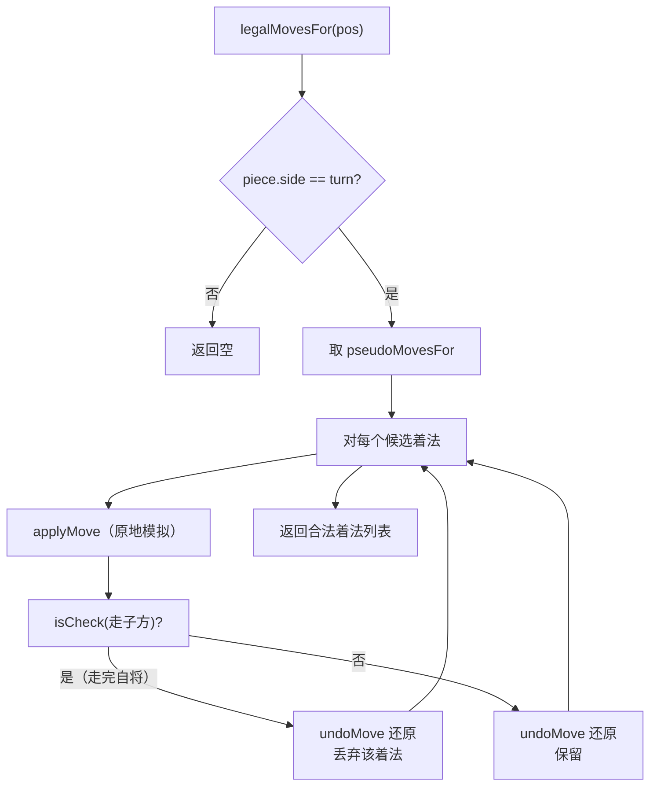
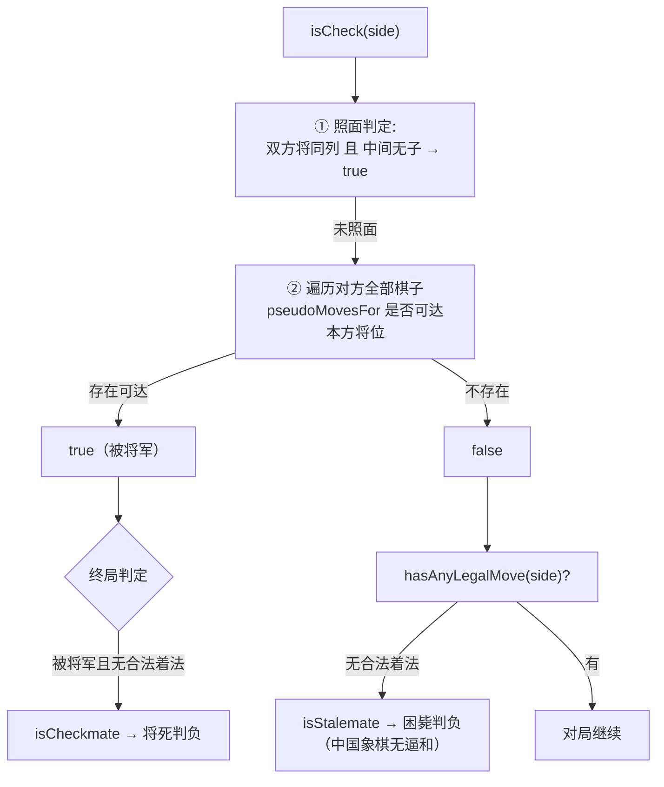
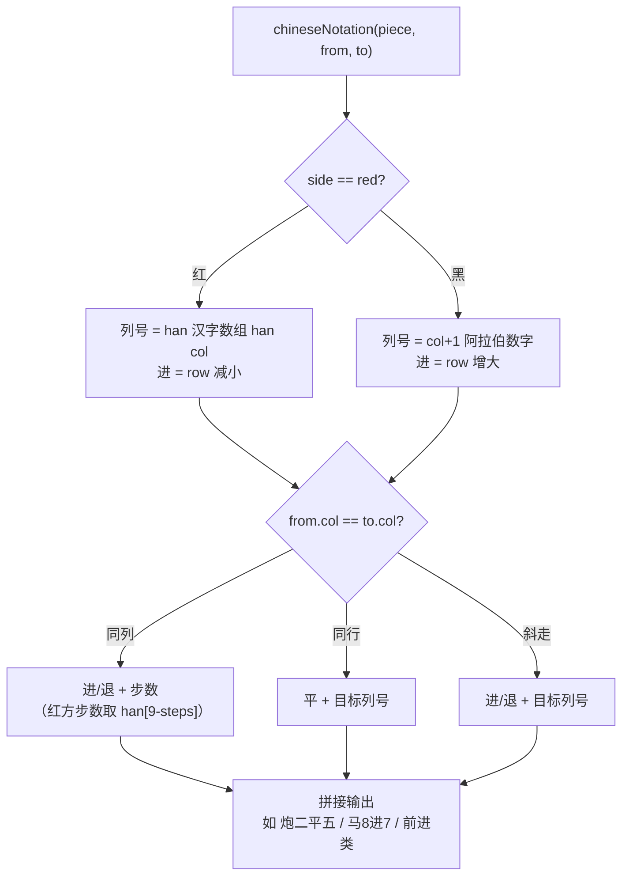
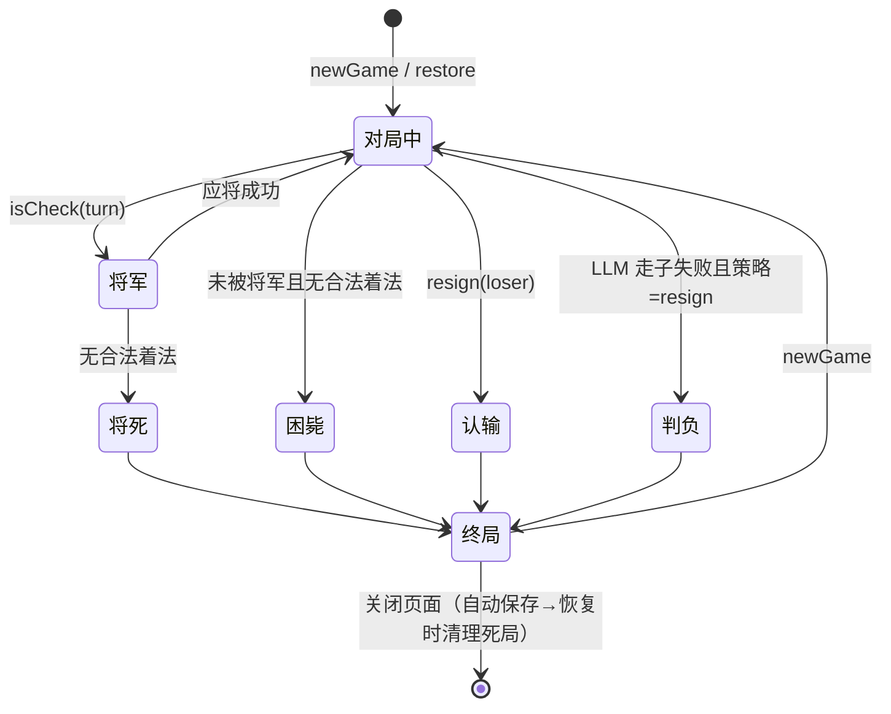

# 02 规则内核设计（packages/rules）

> 对应 Flutter 版 `lib/features/board/model/`（board.dart 421 行核心）。纯 TypeScript，零环境依赖，renderer / Worker / Vitest 三端共用。
> **协议兼容铁律**：坐标系统、FEN 格式、中文记法输出必须与 Flutter 版逐字一致——所有存储数据、LLM 清单、测试金标准都以它为唯一事实源。

---

## 1. 数据结构

### 1.1 坐标系统（`Position`）

- `col: 0..8`（9 列），`row: 0..9`（10 行）。
- **row 0 = 黑方底线（棋盘顶部）**，row 9 = 红方底线（棋盘底部，UI 中红在下）。
- 支持向量加减（可越界，不抛错），由调用方用 `inBoard` 过滤。
- 字符坐标（与 LLM 交互 / ICCS 用）：列 `a-i` = col 0-8；行 `'0'-'9'` = row 0-9。编解码见 05 文档 §5。

### 1.2 棋子（`Piece`）

| 概念 | 定义 | 追溯 |
|---|---|---|
| `PieceKind` | king/advisor/minister/knight/rook/cannon/pawn（红黑共用，颜色由 Side 区分） | `piece.dart:5` |
| `Side` | red/black；`opponent`、`isRed`、`forward`（红 −1 行、黑 +1 行） | `piece.dart:16-27` |
| FEN 字符 | 红大写 `KABNRCP`（象用 B 非 E），黑小写 `kabnrcp` | `piece.dart:31-49` |
| 中文 label | 红：帅仕相马车炮兵；黑：将士象马车炮卒 | `piece.dart:70` |

### 1.3 棋盘（`Board`）

```ts
class Board {
  private grid: (Piece | null)[][];   // [row][col] 10×9
  private redTurn: boolean;
  static fromFen(fen: string): Board;
  static initial(): Board;            // 标准开局 FEN 常量
  copy(): Board;                      // 深拷贝（Worker 快照传参用）
  pieceAt(col, row): Piece | null;
  applyMove(move: Move): Move;        // 栈式回退，返回含 captured 的快照
  undoMove(snapshot: Move): void;     // 用 captured 恢复 + 翻回轮走方
  legalMovesFor(pos: Position): Move[];
  isCheck(side: Side): boolean;
  isCheckmate(side: Side): boolean;   // 被将军 && 无合法着法
  isStalemate(side: Side): boolean;   // 未被将军 && 无合法着法（困毙判负）
  toFen(): string;
}
```

`Move { from: Position; to: Position; piece?: Piece; captured?: Piece }`——`piece` 供记谱/悔棋，`captured` 供 undo；applyMove **不做合法性校验**（校验职责在 `legalMovesFor` 与页面 `playMove`，双层设计必须保留）。

### 1.4 FEN（`fen.ts`）

标准初始局面：`rnbakabnr/9/1c5c1/p1p1p1p1p/9/9/P1P1P1P1P/1C5C1/9/RNBAKABNR w - - 0 1`

- 10 行 `/` 分隔，**从黑方底线到红方底线**；每行 9 列，数字为连续空位；红大写黑小写。
- 第 2 字段：`w`/`b` 为轮走方；解析时 `w` 或 `r` 都算红。
- `isValid`（粗校验）：10 行、每行合计 9 列、字符 ∈ {1-9, KABNRCPkabnrcp}。
- `parseBoard`：行数错/行长≠9/非法字符抛 `FormatException` 等价异常。
- halfMove 固定 0、fullMove 固定 1（原版未维护半回合计数，保持一致）。
- 追溯：`fen.dart:11-104`。

---

## 2. 走法生成

两层设计：`pseudoMovesFor`（伪合法，快，供搜索与 isCheck）→ `legalMovesFor`（自将过滤，供 UI/清单）。

### 2.1 各棋种规则表

| 棋种 | 规则 | 追溯 |
|---|---|---|
| 车 rook | 4 方向滑动，遇子停止，敌子可吃 | `board.dart:322` |
| 炮 cannon | 直线滑空格；吃子需隔**恰一个**炮架后找第一个子，敌子可吃 | `board.dart:348` |
| 马 knight | 8 个 (delta, leg) 模式；**马腿 = 起点往该方向先走一步的位置**（蹩腿检查） | `board.dart:297,314` |
| 象 minister | 4 个田字方向；**象眼 = 田字中心**（`d~/2`）；**不能过河**（`inOwnHalf`） | `board.dart:274-288` |
| 士 advisor | 九宫内斜走一格（九宫 = col 3-5；红 row 7-9 / 黑 row 0-2） | `board.dart:255` |
| 将 king | 九宫内直走一格；**照面不在走法生成里，在 isCheck 里判**（同列中间无子 = 被将军，等效禁止照面） | `board.dart:236,163-175` |
| 兵 pawn | 前进 1 格（红 −1 / 黑 +1）；**已过河**（`!inOwnHalf`：红 row≤4 / 黑 row≥5）时可左右横走；底线后仍仅平移，**无升变** | `board.dart:382` |

辅助判定：`inPalace`（九宫）、`inOwnHalf`（未过河，红 row≥5 / 黑 row≤4）。

### 2.2 走法生成主流程



### 2.3 合法性过滤（自将检查）



要点：模拟-还原用**原地 apply/undo**（非拷贝棋盘），性能关键；`isCheck` 内部含将帅照面判定，因此"送将/照面"天然被过滤。追溯：`board.dart:96,220`。

---

## 3. 将军与胜负判定



追溯：`board.dart:159-197`；终局写入快照在 `board_vm.dart:55-66`。**已实现**：将死、困毙。**未实现（见 §6 规则缺口）**：长将/长捉、重复局面判和、自然限着。

---

## 4. 中文纵线记法（`move_notation.ts`）

输出形如 `炮二平五` / `马8进7`。逐分支算法（`move_notation.dart:9`）：

1. **列号表示**：红方用汉字数字 `['九','八','七','六','五','四','三','二','一']`（`han[col]`，从红方视角右→左）；黑方用阿拉伯数字 `col+1`。
2. **三分支**：
   - `from.col == to.col`（同列直线）→ `棋子 + 进/退 + 步数`；红方步数汉字取 `han[9-steps]`；
   - `from.row == to.row`（同行平移）→ `棋子 + 平 + 目标列号`；
   - 其余（斜走：马/象/士）→ `棋子 + 进/退 + 目标列号`。
3. **进/退方向**：红方 row 减小为进（`forward = -1`），黑方 row 增大为进。



已知局限（保持一致，见 §6）：无"前/后/中"同列多子消歧（如 `前车退一`）——该消歧只在 **PGN 解析器**（06 文档 §3.3）中反向实现，正向记谱不输出。

---

## 5. UI 状态与 VM（对应 board_state / board_vm）

- `BoardState`（不可变快照）：`{fen, moveHistory(不可变), isRedTurn, isCheck, result, selected, legalTargets, lastMove}`。
- VM 职责（Electron 版放 Zustand，**每局一实例**）：
  - `onTap(col,row)`：输入锁（AI/LLM 思考期间）+ 终局忽略 + 选中/换选/走子/取消；
  - `playMove(from,to)`：供 AI/LLM 的**强校验入口**（起点有己方子 + 目标 ∈ legalMovesFor），非法返回 false 不改状态——这是对弈链路的最终裁决点；
  - `undo / undoRound / newGame / newGameFromFen / resign(loser) / restore / serialize`；
  - `restore`：逐手 replay 四元组，跳过长度≠4 / 越界 / 源格无子的脏记录；终局后仅保留 lastMove 高亮。
- 追溯：`board_state.dart:11-53`、`board_vm.dart:24-308`。

对局状态机：



---

## 6. 已知规则缺口（重建时的决策项）

| 缺口 | Flutter 版现状 | Electron 版建议 |
|---|---|---|
| 长将/长捉判负 | 未实现（仅 LLM prompt 里文字警示） | 保持一致；如需实现须同时改 LLM 循环警示逻辑 |
| 重复局面判和 | 未实现（仅求解器路径内剪枝近似） | 保持一致 |
| 自然限着（60 回合无吃子） | 未实现 | 保持一致 |
| FEN halfMove/fullMove | 恒 0/1 | 保持一致（保证对拍与存档兼容） |
| 记谱"前/后/中"消歧 | 正向不输出（仅 PGN 解析反向支持） | 保持一致 |

> 保持一致的唯一理由：289 个既有测试金标准、存档数据、LLM 协议全部绑定当前行为；规则增强属功能变更，不应与迁移混在一个交付里。
