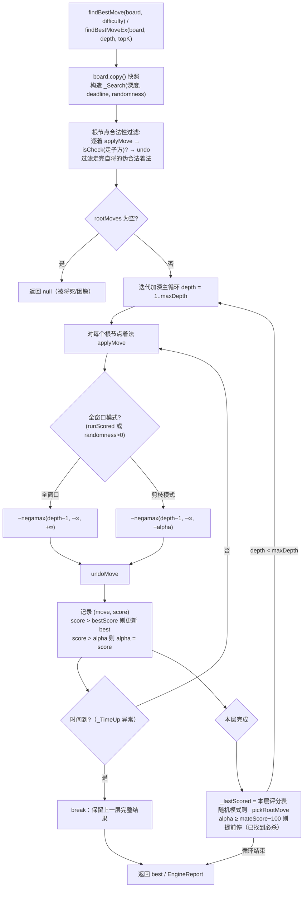
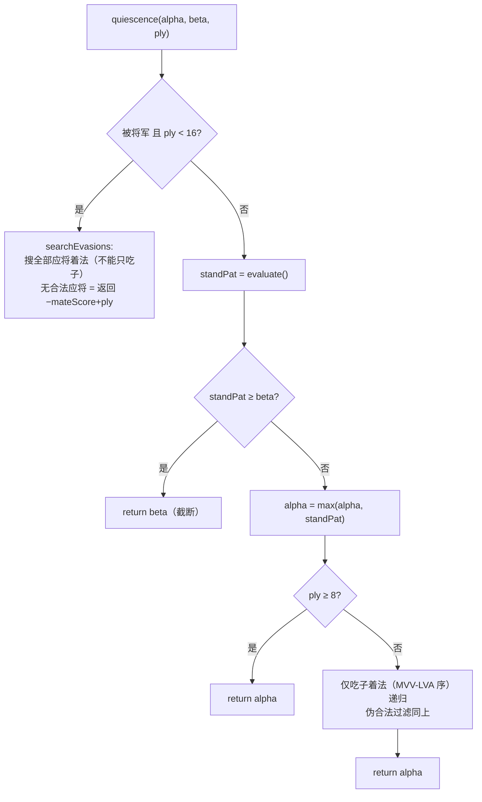
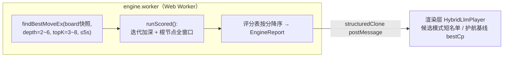
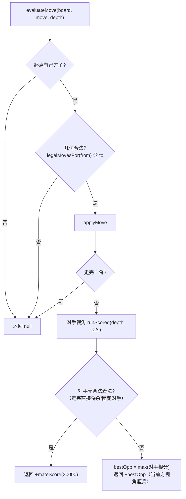
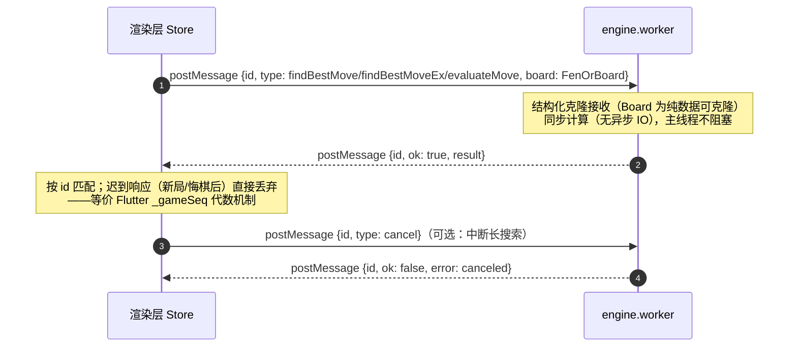

# 03 内置 AI 引擎设计（packages/engine）

> 对应 Flutter 版 `lib/features/shared/engine/ai_engine.dart`（ChessAi，纯 Dart 421 行）。
> 移植为纯 TypeScript，跑渲染进程 **engine.worker.ts**（Web Worker）。算法语义必须与 Dart 版 1:1，保证与 289 个既有测试及 MatchRunner 评估口径对拍一致。

> **受控偏差声明（DR-018/019）**：Zobrist 哈希与重复检测（§3.3）为 Dart 版没有的新增机制，
> 默认关闭——`historyFens` 不传时行为与 Dart 口径逐位一致，既有对拍测试全部保留原期望。

---

## 1. 算法总览

- **Negamax 框架 + Alpha-Beta 剪枝**，MVV-LVA（吃大子优先）走法排序；
- **迭代加深**：由浅入深，超过时间上限返回上一层完整结果（任何难度下应答时长可预期）；
- **静态搜索（Quiescence）**：叶子节点只延伸吃子（≤8 层），被将军时强制搜全部应将（≤16 层），缓解水平线效应；
- **评估**：子力 + 位置修正；
- **低难度根节点随机窗口**：避免每局走法完全相同；
- **重复检测（DR-018，§3.3）**：搜索内路径重复剪枝 + 根节点历史回避（默认关闭，传 historyFens 才启用）；
- **参谋模式三接口**：`findBestMove` / `findBestMoveEx`（参谋报告）/ `evaluateMove`（否决评估）。

## 2. 难度参数表（AI 引擎 1-5 档，区别于参谋深度档）

| 难度 | 深度 | 时间上限 | 根节点随机窗口（厘兵） | 显示名 |
|---|---|---|---|---|
| 1 | 2 | 300ms | 120 | 初级 |
| 2 | 3 | 800ms | 50 | 中级 |
| 3 | 4 | 1600ms | 0（无随机） | 高级 |
| 4 | 5 | 3000ms | 0 | 专家 |
| 5 | 6 | 5000ms | 0 | 大师 |

追溯：`ai_engine.dart:27-34`。随机窗口语义：在「评分 ≥ 最佳 − 窗口」的根节点着法中随机取一。
与 L2 回避阈值（§3.3，DR-018）正交：随机窗口作用于全部着法挑选，L2 仅在最佳着法命中对局历史时介入。

## 3. 主搜索流程



### 3.1 Negamax 递归

```text
negamax(depth, alpha, beta, ply):
  bumpNode()  // 每 64 节点查一次 deadline，超时抛 _TimeUp
  if depth <= 0: return quiescence(alpha, beta, ply)
  for move in orderedMoves():          // MVV-LVA 排序
    applyMove(move)
    if isCheck(走子方): undo; continue // 伪合法过滤
    score = -negamax(depth-1, -beta, -alpha, ply+1)
    undo
    if score >= beta: return beta      // β 截断
    if score > alpha: alpha = score
  if 无任何合法着法: return -(mateScore) + ply   // 将死/困毙，越早被杀越差
  return alpha
```

### 3.2 静态搜索（Quiescence）



追溯：`ai_engine.dart:262-338`。

### 3.3 搜索内重复检测与 Zobrist（DR-018/019，默认关闭）

完整算法、参数与流程图见 `built-in-ai-move-repetition-optimization-design-final.md` §2-§4。要点：

- **Zobrist（DR-019）**：`EngineBoard` 内维护 `hashLo/hashHi` 双 32 位增量键
  （表索引 `(pieceCode+7)*90+sq` + 先手方键，固定种子 xorshift32），
  `applyMove/undoMove` 对称异或；`fromFen` 全量重建，测试锁定增量===重建。
- **L1 路径重复**：negamax 每层压栈回扫，同键第 1/2/3+ 次返回 −50/−150/0（厘兵，
  走子方视角）；命中即剪枝不展开。qsearch 不检测（吃子线不可能成环）。
- **L1 全局历史**：仅 ply≤3 且出现次数 ≥2 时返回 `evaluate() − 100×(count−1)`；
  深层不查，防止棋力劣化。
- **L2 根节点回避**：`findBestMove` 接受可选 `historyFens`；最佳着法落子后局面键
  在历史中出现 ≥1 次即触发——阈值内（基础值 难度1-2:200 / 3:100 / 4:50 / 5:30，
  优劣势系数 ±200 厘兵处 ×0.5/×2.0）随机换非重复着法；长将形态强制变着
  （底线 −500 厘兵）；无候选交规则层裁决（L3）。
- **可复现性**：`findBestMoveEx` / `evaluateMove` **不接受** `historyFens`，
  §5.1 的零随机/真实分差口径不变。

## 4. 评估函数

| 子力 | 厘兵价值 | 位置修正 |
|---|---|---|
| 帅 king | 10000 | — |
| 车 rook | 900 | 沉底车 +10 |
| 炮 cannon | 450 | 居中 +4×中距 |
| 马 knight | 400 | 居中 +4×中距 |
| 相/士 minister/advisor | 200 | — |
| 兵 pawn | 100 | 过河：40 + 8×中距 |

- `中距 = 4 − |col − 4|`；"过河"红 row≤4 / 黑 row≥5；"沉底"红 row 0 / 黑 row 9。
- 静态分 = Σ(红子价值) − Σ(黑子价值)，再按轮走方视角取正负（`isRedTurn ? score : -score`）。
- 将杀评分：`mateScore = 30000`，返回 `−mateScore + ply`（区分被杀步数）；`infinity = 100000`。
- 追溯：`ai_engine.dart:368-410`。

## 5. 参谋报告接口（引擎参谋制的数据源）

### 5.1 findBestMoveEx（Top-K 真实分差报告）

与普通搜索的区别（`ai_engine.dart:61-82`）：

1. **零随机窗口**——分数是真实分差、名单稳定可复现（**不受** §3.3 历史回避影响，接口不接受 historyFens）；
2. **根节点强制全窗口**（不剪枝）——剪枝模式下非最佳分支返回的是**边界值**，无法用于否决阈值计算；
3. 复用根节点循环拿全量 `(move, score)` 表，按分数降序取 Top-K。

返回 `EngineReport { best: Move; bestCp: number; topK: Array<[Move, number]> }`。



注意：**K 之后的分数仅供参考**（超时返回上一层时同样是全窗口真实分差，但深度较浅）；Top-K 内排序可信。

### 5.2 evaluateMove（单着法评估，护航否决用）

流程（`ai_engine.dart:89-111`）：



毫秒级（浅 1 层 + 2s 上限）；**必须先做几何合法性校验**——applyMove 不校验蹩腿等伪非法着法。

## 6. Worker 交互模型



要点：

- Worker 数量 **1 个**即可（同一时刻只有一方在思考）；LLM vs LLM 双方都可能是引擎参谋 → 排队串行，符合原版 Isolate 语义；
- `findBestMove` 载荷可选 `historyFens: string[]`（DR-018，逐手 FEN 含轮走方）；不传时引擎行为与 Dart 口径逐位一致（向后兼容）；
- Worker 内抛错（如将死返回 null）映射为 `ok:false/error` 消息，渲染层收口；
- 取消：搜索循环每 64 节点检查取消标志（对齐 `_bumpNode` 的 deadline 检查节奏）；
- 降级：Worker 初始化失败时（极端环境）回退渲染线程同步计算，**与原版"Isolate 不可用退化同步"兜底一致**（`move_source.dart:107-113`）。

## 7. MoveSource 抽象（棋手接口，1:1 保留）

```ts
interface MoveSource {
  displayName: string;                       // 状态栏显示，如 "glm-4-flash" / "内置 AI（高级）"
  nextMove(board: Board, history?: Move[]): Promise<MoveSourceResult>;
}
type MoveSourceStatus = 'ok' | 'noLegalMove' | 'failed';
interface MoveSourceResult {
  status: MoveSourceStatus;
  move?: Move;
  note?: string;        // 思路/解说/失败原因，状态栏展示
  fromFallback?: boolean; // true = 来自兜底而非模型本身
}
```

实现清单：`ChessAiPlayer`（难度 1-5）、`LlmPlayer`、`HybridLlmPlayer`（05 文档）。接口契约：**实现必须保证返回的 move 是合法着法**；页面 `playMove` 仍做最终校验（双保险，`move_source.dart:75-86`）。

## 8. TS 移植性能注意

1. 棋盘用 `Int8Array(90)` 一维数组替代 Dart 二维数组，棋子编码为 int（kind + side），`copy()` 变成 `slice()`——TS 下这是拿回性能的最大单项；
2. `applyMove/undoMove` 用栈式回退 + captured 编码入栈（对齐原版语义），避免对象分配；
3. 走法生成避免闭包分配，输出到复用数组；
4. 性能验收门：难度 5（深度 6）应答 ≤ 5s × 1.5；超出则优化走法生成（位棋盘不在本期范围）；
5. 重复检测开销门（DR-018）：Zobrist 增量 O(1)；基准 FEN 集开/关 L1 的 nodeCount 差 ≤5%（L1 命中即剪枝，重复线反而省节点）；L2 全窗口重搜仅发生在最佳着法命中历史的罕见路径。
