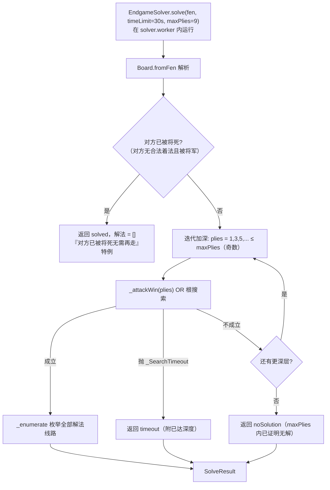
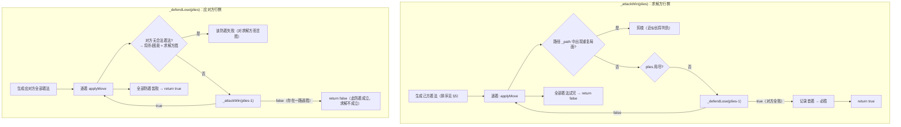
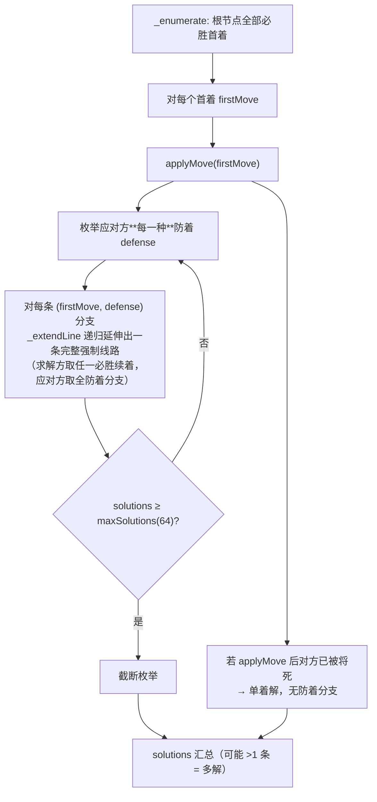
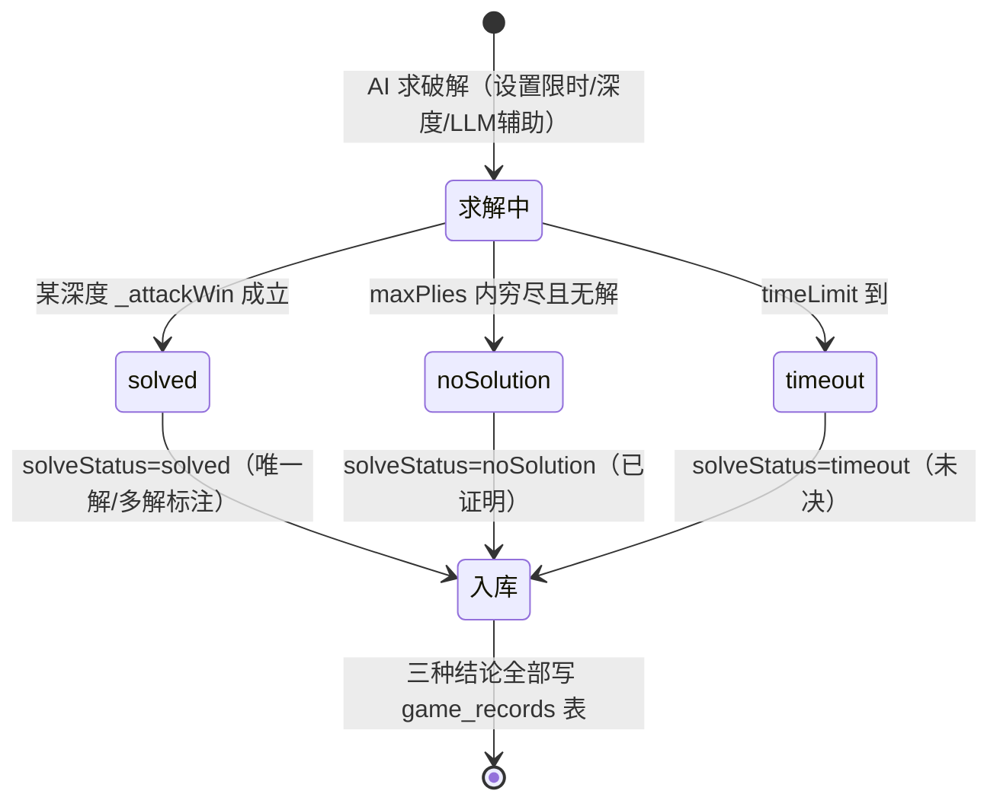
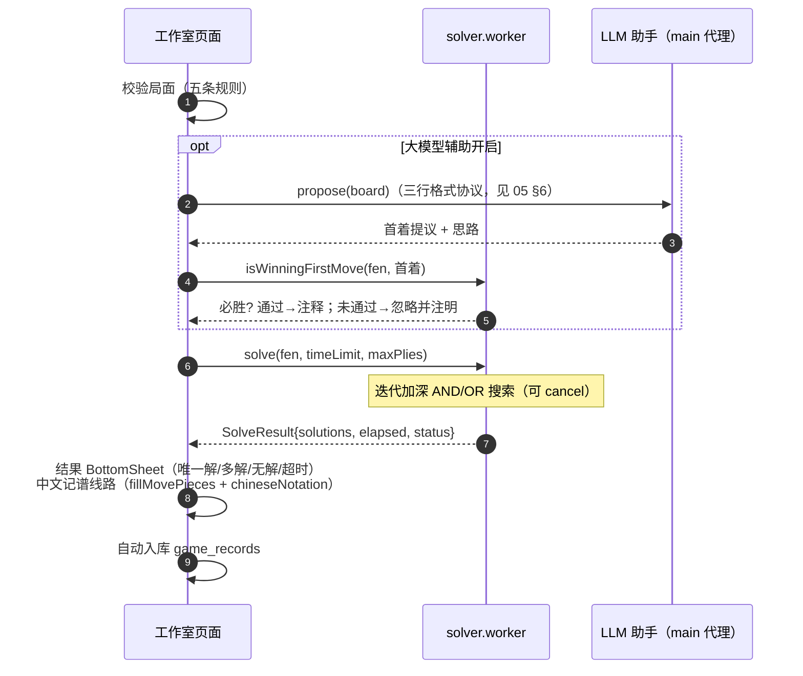

# 04 残局求解器设计（packages/solver）

> 对应 Flutter 版 `lib/features/solver/endgame_solver.dart`（374 行，纯 Dart）。
> 与评分引擎的本质区别：这是**证明问题**（存在必胜策略并给出强制线路），不是评分问题——评分引擎不能当求解器（docs/phase4/01 调研结论）。

---

## 1. 核心语义

| 概念 | 定义 |
|---|---|
| OR 节点（求解方行棋） | **存在一路**必胜走法即胜 |
| AND 节点（应对方行棋） | **所有**防着皆败才胜 |
| 多条解法 | 分叉**只发生在应对方防着处**——求解方换一个必胜着法不算新解（`endgame_solver.dart:42-52`） |
| 必胜判定 | 将杀**或困毙**均判胜（中国象棋无逼和，`:183`） |
| 路径去重 | `_path` 中出现重复局面即剪枝（近似长将判负，已知限制 `:51-52`） |

数据结构：

```ts
type EndgameSolveStatus = 'solved' | 'noSolution' | 'timeout';  // 与棋谱 SolveStatus 一一对应
interface SolverSolution { moves: Move[] }   // 一条强制线路（裸坐标）
interface SolveResult {
  status: EndgameSolveStatus;
  solutions: SolverSolution[];
  elapsed: number;        // ms
  searchedPlies: number;  // 达到的最大深度
}   // unique getter：solutions.length === 1
```

## 2. 主流程



## 3. AND/OR 递归与置换表



置换表（`endgame_solver.dart:166-232`）：

- `_winAt: Map<fenKey, boolean>`、`_failAt: Map<fenKey, boolean>`（按 FEN 字符串键）；
- 命中 `_winAt` 直接判胜、`_failAt` 直接判败，避免重复展开；
- 每次递归 push/pop 局面 FEN 进 `_path`。

## 4. 多解枚举（_enumerate + _extendLine）



约束：`timeLimit` 默认 30s（可设 10s/30s/1min/3min）；`maxPlies` 默认 9 半着（浅 5 / 标准 9 / 深 13）；`maxSolutions = 64`；`_tick` 每 512 节点查一次截止时间抛 `_SearchTimeout`（`:303-320`）。

## 5. 着法排序（加速剪枝）

| 优先级 | 类别 | 分值 |
|---|---|---|
| 1 | 将军着法 | +500 |
| 2 | 吃子（按子力价值 车90/炮45/马40/士象20/兵10） | 递减 |
| 3 | 其他 | 0 |

追溯：`endgame_solver.dart:327-361`。

## 6. isWinningFirstMove 验证接口（LLM 求解辅助的裁判）

```ts
static isWinningFirstMove(fen: string, firstMove: Move,
  opts?: { timeLimit?: Duration; maxPlies?: number }): boolean
```

语义：把 `firstMove` 当作根节点唯一首着跑 `_attackWin`——若成立，该首着必胜。专供工作室"大模型辅助"流程：**LLM 提议 → 此接口验证 → 通过才写入棋谱注释**（05 文档 §6）。追溯：`endgame_solver.dart:102-110`。

## 7. 求解状态机与入库



三种结论**全部自动入库**（`endgame_studio_page.dart:694-735`）：mode='endgame'、solutions 为 ICCS 坐标数组的数组、标题自动生成（"M-D 红方残局（唯一解/多解/无解/未决）"）、llmNote 附 LLM 辅助结论。

## 8. 求解入口完整时序（含 LLM 辅助）



## 9. TS 移植要点

1. 依赖仅 `packages/rules`（Board 层），**不依赖引擎**；
2. 置换表用 `Map<string, boolean>`，键为完整 FEN 字符串（对齐原版；性能可后续优化为 Zobrist，不在本期）；
3. `_path` 去重用 `Set<string>` 存局面键，递归进出 push/delete；
4. Worker 协议同 03 文档 §6（id/type/cancel/progress）；取消检查每 512 节点；
5. 单元测试必须覆盖 6 个内置验证 FEN（多解/无解/超时/已将死/非法/缺王，docs/phase4/03）。
