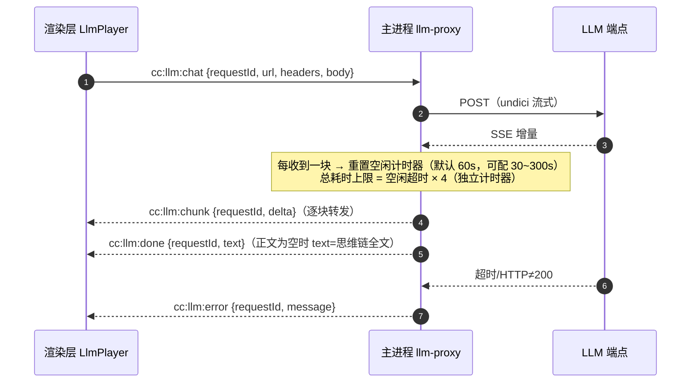
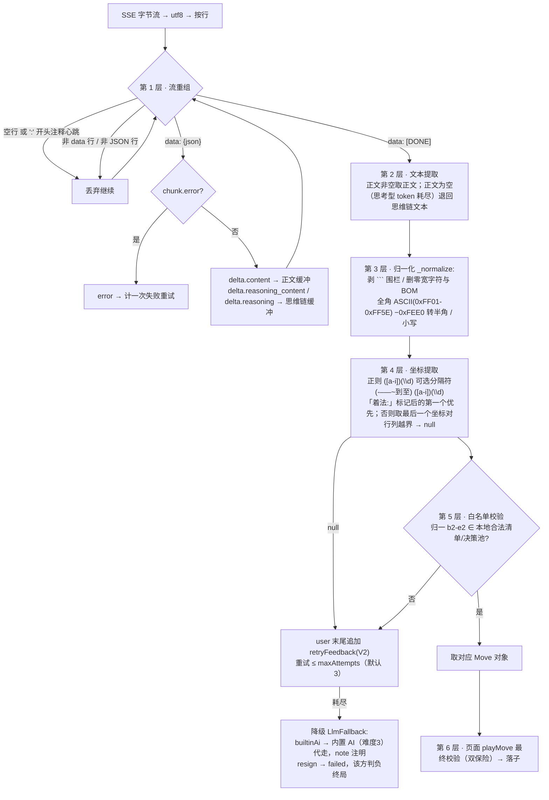
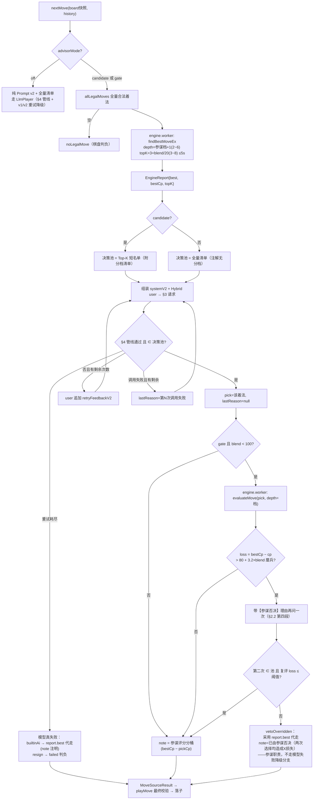
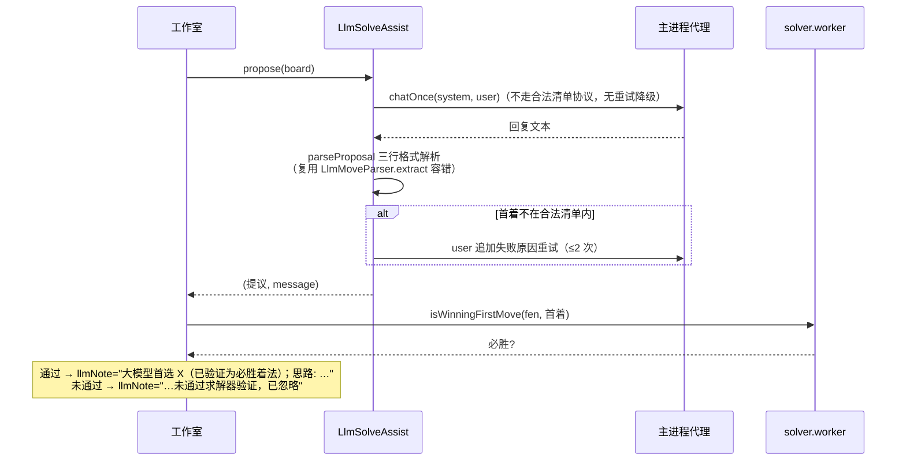
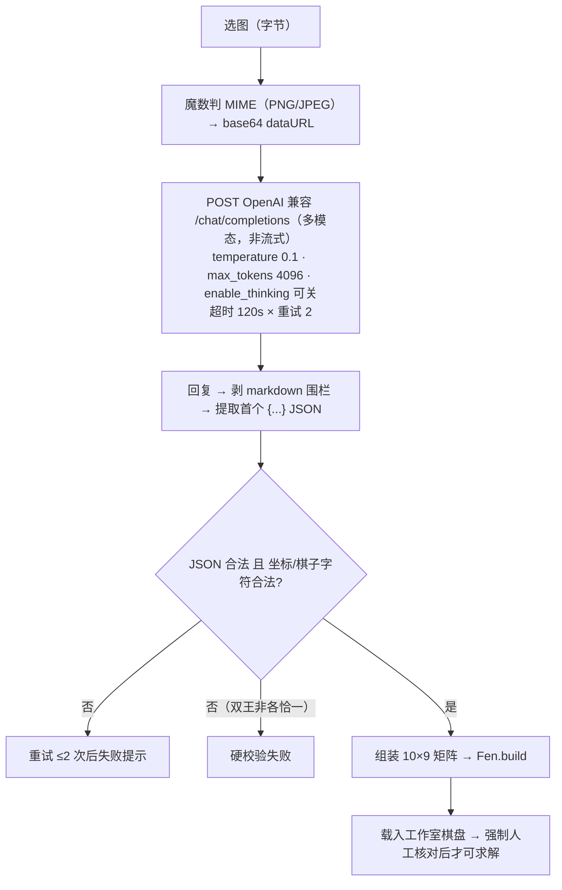
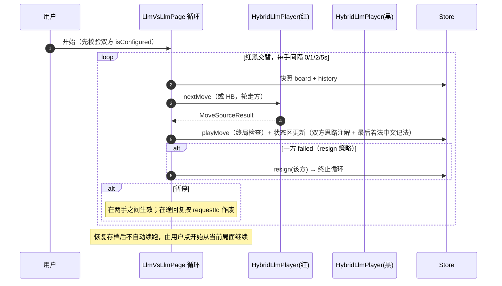

# 05 大模型集成设计（packages/llm + 主进程代理）

> 对应 Flutter 版 `lib/features/shared/engine/` 中 llm_move_source.dart（549 行）、hybrid_llm_move_source.dart（368 行）、llm_solve_assist.dart、vision_board_reader.dart、match_runner.dart。
> **协议铁律**：§2 的提示词文本与 §4 的过滤管线是五期实测调优结果（失误率 21%→0%），**逐字搬运、禁止意译改写**。

---

## 1. 总体架构：本地裁决 + 远程提议

四条设计不变式（改任何一条合法率都会崩）：

1. **LLM 只提议，本地规则是唯一事实源**：客户端先用本地规则生成合法着法白名单，模型回复必须与白名单**精确匹配**；
2. **坐标即清单语言**：清单条目与期望输出同构（`b2-e2`），模型只需"复制"不需"换算"；
3. **无状态两消息请求**：每次请求只有 system+user；重试是把失败反馈**追加到 user 末尾后重发**，不是多轮累积；
4. **兜底链永不卡死**：重试耗尽 → 内置 AI 代走或判负；参谋否决 → 带理由再问 → 引擎最佳代走（参谋职责，不算模型失败）。

Electron 版落位：协议编排（Prompt/解析/参谋/重试/降级）在 `packages/llm`（纯 TS，渲染层调用，引擎能力经 Worker）；对外 HTTP 在主进程 undici 代理（00 文档 DR-004，规避渲染层 CORS）。

## 2. 完整提示词（协议原文）

### 2.1 Prompt v1（严格单行，能力评估基线保留）

**system**（仅执方变化）：

```text
你是中国象棋对弈引擎的着法接口，本局执红方。
坐标约定：列用字母 a-i（从左到右），行用数字 0-9（0 为黑方底线、棋盘顶部，9 为红方底线、棋盘底部）。
你只能从用户提供的「合法着法清单」中选择一步，禁止编造清单之外的着法。

【回复格式（唯一允许的格式，违反即视为无效）】
整个回复只包含一行，形式为：
着法: 起点-终点
示例：着法: b2-e2

禁止输出：任何解释、推理过程、心理活动、道歉、开场白、markdown、代码块、引号、多行文本。
你的回复将被程序逐字解析，任何多余字符都会导致这步棋作废。
```

**user**（v1）：

```text
【当前局面 FEN】rnbakabnr/9/1c5c1/p1p1p1p1p/9/9/P1P1P1P1P/1C5C1/9/RNBAKABNR w - - 0 1
【轮走方】红方（该方是你）
【最近着法（中文记法，最新在最后）】炮二平五  马8进7  （最多最近 12 手）
【合法着法清单（共 44 条，必须从中选择一条）】
a6-a5, a9-a7, …, i9-i8
【输出】仅一行，格式：着法: 起点-终点（起点与终点均取自上方清单）
```

**v1 重试反馈**（追加到 user 末尾）：

```text

你上一次的回复无效（{reason}）。请重新回答：整个回复只含一行「着法: 起点-终点」，着法必须取自合法着法清单，不要输出任何其他文字。
```

### 2.2 Prompt v2（当前主力：棋盘图 + 注解 + 分析段）

**systemV2(side, withBucketGuide)**：

```text
你是中国象棋对弈引擎的着法接口，本局执{红方|黑方}。
坐标约定：列用字母 a-i（从左到右），行用数字 0-9（0 为黑方底线、棋盘顶部，9 为红方底线、棋盘底部）。
你只能从用户提供的「合法着法清单」中选择一步，禁止编造清单之外的着法。

【回复格式（唯一允许的格式，共两段）】
第一段以「分析:」开头，用一两句话（不超过 100 字）说明你的计划（进攻目标、需要提防的威胁）。
最后一段为一行，形式为：
着法: 起点-终点
示例：着法: b2-e2

{候选模式：合法着法清单中每条着法附有括号注解（中文记法/吃子/将军）与「—」后的引擎评估分档，请优先考虑评估为「最佳/均势」的着法，避免选择「大亏/致命」档的着法。
护航/off 模式：合法着法清单中每条着法附有括号注解（中文记法/吃子/将军）。}
```

**userV2 / Hybrid user**：

```text
【当前局面 FEN】{board.toFen()}
【棋盘图】
    a b c d e f g h i
0  r n b a k a b n r
...（10 行，大写红/小写黑，'.'为空）
【轮走方】{红方|黑方}（该方是你）
【对局着法（中文记法，最新在最后）】{整局中文记法，≤60 着，空则"（开局，暂无历史）"}
{检出循环时：【警示】最近着法出现来回重复。长将/长捉判负，重复局面会被视为无效——请选择打破循环的着法。}
【{候选着法清单（共 N 条，由本地引擎选出，必须从中选择一条；「—」后为引擎评估分档）|
   合法着法清单（共 N 条，必须从中选择一条；括号内为中文记法/吃子/将军注解）}】
b2-e2(炮二平五,吃卒,将军) — 最佳/均势      ← 候选模式每行此格式
h0-g2(马八进七) — 最佳/均势
{护航/off 模式：b2-e2(炮二平五,吃卒,将军) 无分档}
...
【输出】先输出「分析:」段，最后一行输出「着法: 起点-终点」（起点与终点均取自上方清单）
```

**v2 重试反馈 retryFeedbackV2**（追加到 user 末尾）：

```text

你上一次的回复{的着法 {lastCode}}无效（{reason}）。着法必须取自合法着法清单。请重新回答：先「分析:」一两句，最后一行「着法: 起点-终点」。
```

**参谋否决再问**（追加到 user 末尾，gate 模式）：

```text

【参谋否决】你上一次选择的 {vetoed} 会被引擎惩罚（{分桶文字}，相对最佳损失 {loss} 厘兵）。请重新从候选清单中选择，优先考虑「最佳/均势」档；先「分析:」一句，最后一行「着法: 起点-终点」。
```

清单行与辅助文本的生成规则（`move_annotation.dart`）：

- 注解：`{坐标}({中文记法}{,吃X}{,将军})`——吃子取棋盘实际被吃子；走后 probe.isCheck(对方) 则加"将军"；
- 分桶 `scoreBucket(cpDiff)`：≤30 最佳/均势｜≤100 略亏｜≤250 明显亏（约半子）｜≤600 大亏（丢一马/一炮级）｜否则 致命（丢车/被将杀级）；
- ASCII 棋盘：10 行，行首 `row  两空格`，列间单空格，列标行 `    a b c d e f g h i`；
- 循环检测：`isInverse(h[n-1],h[n-3]) && isInverse(h[n-2],h[n-4])`，`isInverse(a,b) = a.from==b.to && a.to==b.from`；
- 历史：Hybrid/v2 用中文记法最多 60 着；v1 最多 12 着。

## 3. HTTP 请求（主进程 undici 代理）

### 3.1 请求格式

```http
POST {requestUrl}                      # baseUrl 去尾斜杠，无 /chat/completions 则自动补
Content-Type: application/json
Accept: text/event-stream
Authorization: Bearer {apiKey}         # 仅当 Key 非空才携带（本地网关允许空 Key）

{
  "model": "{model}",
  "messages": [
    { "role": "system", "content": "…" },
    { "role": "user",   "content": "…" }
  ],
  "temperature": 0.3,
  "max_tokens": 8192,                  # v1 协议 4096
  "stream": true,
  "enable_thinking": false             # 仅 disableThinking=true 时发送
}
```

### 3.2 超时模型（思考型模型兼容）



- **空闲超时**：两次数据块的最大间隔（模型持续吐字不误判）；
- **总上限**：空闲超时 × 4，防思维链无限输出；错误消息提示"可调大超时或开启关闭思维链"；
- 取消：渲染层发 `cc:llm:cancel{requestId}` → 主进程 AbortController.abort；
- HTTP ≠ 200：截取响应体前 160 字符进错误消息；含"streaming translation"/"invalid_parameter_error"/"input.messages" 时附加模型类型误用提示（翻译模型/图片生成模型不能对弈识图，`annotateModelHint`）。

## 4. 返回数据五层过滤管线



第 4 层提取后经 `decodeCell`（col=a-i、row=0-9 越界即 null）再 `encodeMove` 归一为 `b2-e2` 形式参与比对。**白名单比对是精确字符串匹配**——本地规则是唯一事实源。

## 5. 单手棋总决策流程（HybridLlmPlayer，三模式）



关键数值（`hybrid_llm_move_source.dart:74-78`）：

| 旋钮 | 公式 | 范围 |
|---|---|---|
| 短名单 K | `3 + blend/20` | 3~8 |
| 否决阈值 | `80 + 3.2×blend` 厘兵 | 80~400（blend=100 时不否决） |
| 参谋搜索深度 | 档位 1~5 → 迭代深度 2~6 | 否决复评用 档位深度（比报告浅 1） |

lastReason 语义：仅记录"模型未给出有效着法"类真失败；一旦给出池内着法即置 null。护航模式的选择不在 Top-K 时（`_cpOf` 返回 null）用否决评估值或单独评估补齐 note。

## 6. LLM 求解辅助（LlmSolveAssist，Hybrid 架构）

协议（`llm_solve_assist.dart:14-42`）：

**system**：要求三行固定格式——`首选着法: {ICCS}` / `备选着法: {ICCS}` / `思路: …`；
**user**：`FEN + ASCII 棋盘图 + 轮走方 + 任务说明 + 完整合法着法清单`。

流程：



## 7. 视觉识图（VisionBoardReader）



识图提示词 `visionPrompt` 强约束输出：

```json
{"turn":"red|black","pieces":[{"col":"a-i","row":"0-9","piece":"FEN字符"}]}
```

（红大写/黑小写；坏 JSON/越界/未知棋子抛错；双王校验 `_validateKings` 硬性不过。）
实测：开思维链 61–115s，关闭后 6–14s → 助手槽位默认 disableThinking=true。使用**视觉模型**（qwen-vl-max / glm-4.5v / gpt-4o-mini 等预设）；翻译/图片生成模型不可用（§3.2 错误提示）。

## 8. LLM vs LLM 对局循环与 MatchRunner

### 8.1 对局页循环（llm_vs_llm_page）



### 8.2 MatchRunner（无 UI 评估运行器，`match_runner.dart`）

- 两个 MoveSource 对打；单手超时默认 5 分钟；失败/无着 = 当方认输；合法性终审兜底；
- `evaluateQuality` 开启时每手在 Worker 用 `findBestMoveEx` + `evaluateMove`（深度对齐口径）算失误数（分差 >250 厘兵）与 Top-3 命中/失随；
- `MatchReport` JSON：winner（red/black/draw-limit/red-resign/black-resign/red-illegal/black-illegal）、endReason、plies、双方耗时、兜底次数、着法序列；
- `runSeries`：多局红黑换边；4 profile：`baseline-v1` / `p0-prompt-v2` / `hybrid-candidate` / `hybrid-gate`，每档与内置 AI（难度 3）红黑各一局；
- Electron 版以 CLI（`npm run eval`，走 Node 直连 packages/*，无需窗口）+ JSON 报告落盘实现。

## 9. 对局设置（非敏感，electron-store）

`LlmGameSettings`（键前缀 `llm_settings_`，越界一律 clamp 回默认）：

| 项 | 默认 | 范围 |
|---|---|---|
| timeoutSeconds | 60 | 5–600 |
| maxAttempts | 3 | 1–10 |
| fallback | builtinAi | builtinAi/resign |
| intervalSeconds | 1 | 0–60 |
| advisorMode | — | off/candidate/gate |
| strengthBlend | 50 | 0–100 |
| advisorDifficulty | 5 | 1–5 |
| red/blackStrengthBlend | 各自独立 | 仅 LLM vs LLM |

追溯：`llm_settings.dart:9-169`。敏感配置（Key）走 safeStorage 三槽位 `llm_config_red/black/assistant`（07 文档 §4）。
