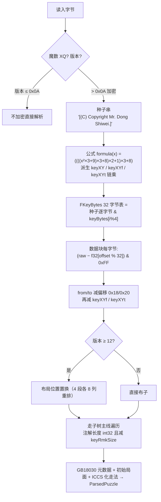
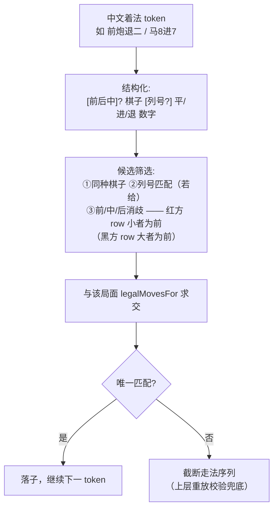
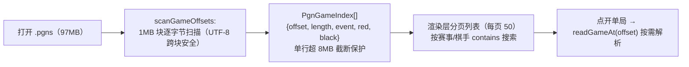
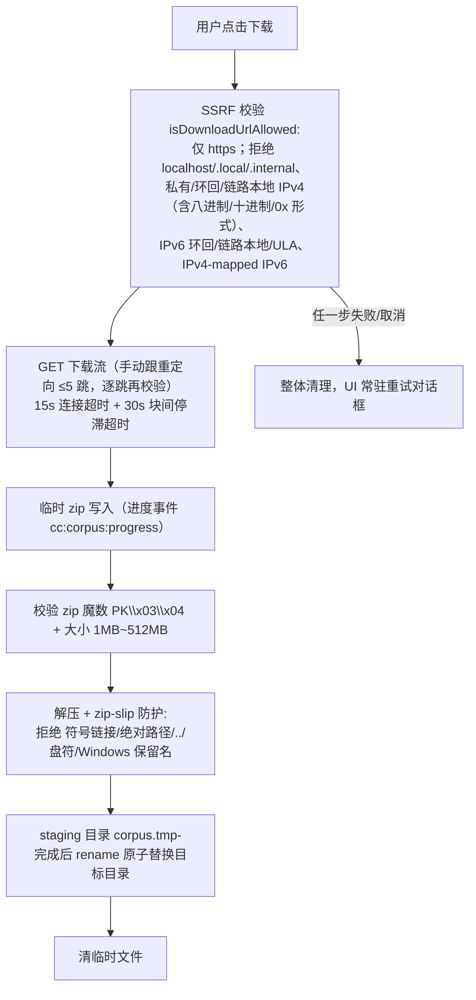
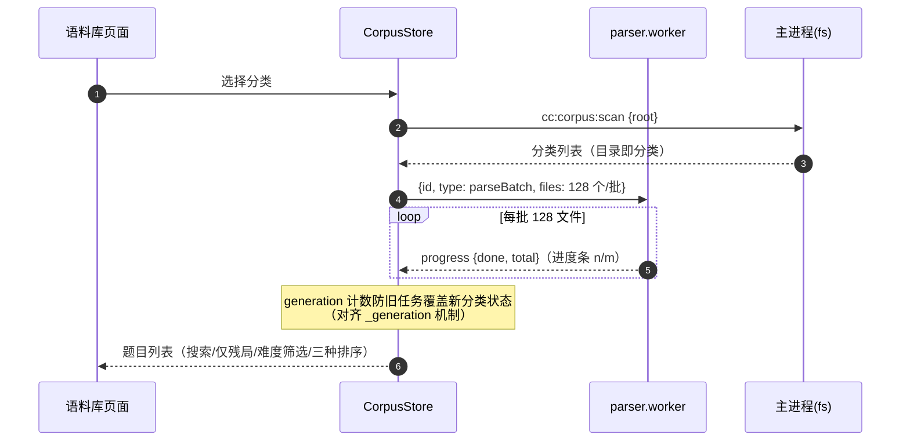

# 06 语料库与棋谱解析设计（packages/parsers + 主进程下载器）

> 对应 Flutter 版 `lib/features/puzzle/`（约 1966 行模型 + 1573 行视图）。
> 语料规模：XQF-象棋谱大全 2911 个 .xqf（48MB）、ChessQ-gamebooks 151 个残局 .xqf、CGLemon-PGN 两个大文件（41743 局 40MB + 99813 局 97MB）。

---

## 1. 语料目录约定与扫描

```text
<corpusRoot>/
├── XQF-象棋谱大全/<分类>/**/*.xqf        # 逐文件懒解析，按一级子目录聚合分类
├── ChessQ-gamebooks/gamebooks/**/*.xqf   # 残局杀势
└── CGLemon-PGN/{wxf,dpxq}/ICCS/*.pgns    # 多局合一 PGN 大文件（每文件一个分类）
```

- 扫描：忽略 `_` 开头目录；XQF 的 source 取相对路径前两级（如"残局/适情雅趣"）；
- 目录解析优先级：用户设置（electron-store `corpus.userPath`）> 平台默认 `<文档>/ChineseChessUltra/corpus`；
- 追溯：`corpus_paths.dart:151-172`、`corpus_scanner.dart:8-230`。

## 2. ICCS 坐标格式（`iccs.ts`）

- 格式：列 `a-i`（**红方视角左→右**）+ 行 `0-9`（**0 为红底线**），如 `h3e3` / `H3-E3`；
- 与内部坐标换算：**`row = 9 − rank`**（内部 row 0 为黑底线）；
- 解析宽松正则：`^\s*([a-iA-I])(\d{1,2})\s*-?\s*([a-iA-I])(\d{1,2})\s*$`（兼容黑底线写 10 的遗留写法）；输出小写紧凑形式。
- 追溯：`iccs.dart:7-59`。**注意与走子源 `encodeCell` 的区别**：后者行 0 为黑底线（LLM 协议），两者行号镜像，禁止混用。

## 3. XQF 解析器（象棋演播室二进制，`xqf_parser.ts`）

### 3.1 文件结构

- 魔数 `0x58 0x51`（"XQ"）+ 第 3 字节版本号；版本 ≤0x0A 旧格式无加密；
- 头部 0x400 字节，GB18030 编码：标题@80、事件@208、日期@272、红方@352、黑方@368；
- 缺将帅 → `FormatException`；
- 32 子固定序（车马相仕帅仕相马车+炮炮+兵×5，红大写黑小写），每子 1 字节 `x*10+y`，0xFF=让子；
- 走子记录树只取**主线**：每记录 4 字节（from/to/flag/reserved），flag 位 0x20 有注解、0x80 有后续。

### 3.2 解密算法（Dong Shiwei 种子）



追溯：`xqf_parser.dart:7-346`。TS 侧 GB18030 解码用 `iconv-lite`。

## 4. PGN 解析器（`pgn_parser.ts`）

### 4.1 预处理

剔标签行（保留 `[FEN]`/Event/Red/Black/Date/Site）→ 单遍扫描去 `{...}` 块注释与 `;...` 行注释 → **循环删最内层 `(...)` 变着**（只留主线）→ 去序号/NAG/结果标记。

### 4.2 双着法格式

- ICCS 坐标（§2）；
- **中文纵线记谱**：`炮二平五`、`马8进7`、`前炮退二`，红方汉字数字、黑方阿拉伯数字，兼容全角０-９。

### 4.3 中文记谱消解算法（核心难点）



追溯：`pgn_parser.dart:44,194-265`。

### 4.4 大文件流式索引（99813 局的关键设计）



追溯：`pgn_parser.dart:430-581`、`corpus_pgn_browser_page.dart:172-223`。

### 4.5 解析门面与校验（`puzzle_parser.ts`）

- 按扩展名分发：XQF 单局 / PGN 多局；>8MB 的 .pgn/.pgns 走流式索引路径；
- **重放校验**：用规则内核 Board 逐着重放，非法着截断（至少 1 着否则弃局）；id 冲突加 `#` 后缀；难度按实际步数重算（`difficultyFromMoveCount`：≤20 入门 / ≤40 初级 / ≤80 中级 / ≤150 高级 / >150 职业）；
- 类型判定 `isEndgamePuzzle`：来源含"残局/排局/杀势"→是；含"全局/大师/比赛/布局/中局/名局/让子"→否；否则比较 initialFen 与标准开局；
- 追溯：`puzzle_parser.dart:30-102`、`puzzle_data.dart:56-74`。

## 5. 语料下载器（主进程，安全设计）

下载源：`https://github.com/jxsword/qp-corpus/releases/latest/download/qp-corpus.zip`（约 45.8MB，解压后约 245MB）。无断点续传（失败/取消整体重来）——Electron 版**增强为 Range 续传**（ETag 一致性校验），失败安全保留原语义。



追溯：`corpus_downloader.dart:48-311`、`corpus_paths.dart:41-100`。

## 6. 批量解析与浏览交互（parser.worker）



筛选排序（`corpus_browser_vm.dart:71`）：搜索框 + 仅看残局 FilterChip + 难度下拉（入门~职业）+ 排序（名称/步数/难度）。语料缺失时显示引导（期望路径 + 下载按钮约 45MB + 桌面端"选择其他棋谱目录"）。

## 7. 演示播放器（puzzle_vm 对应实现）

- 独立 Board 实例；`Timer` 按间隔逐条应用 ICCS 走法（默认 600ms/步、间隔 800ms、速度 0.5x/1x/2x + 自定义 200–4000ms）；
- 状态机 idle → playing → paused → completed/error；循环播放重置棋盘重播；
- **走子数据与局面不一致时跳过该步防崩溃**（`:165-184`）；
- 棋盘只读渲染 + lastMove 高亮（复用 08 文档棋盘组件）。
