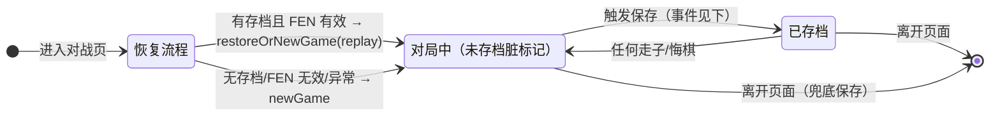
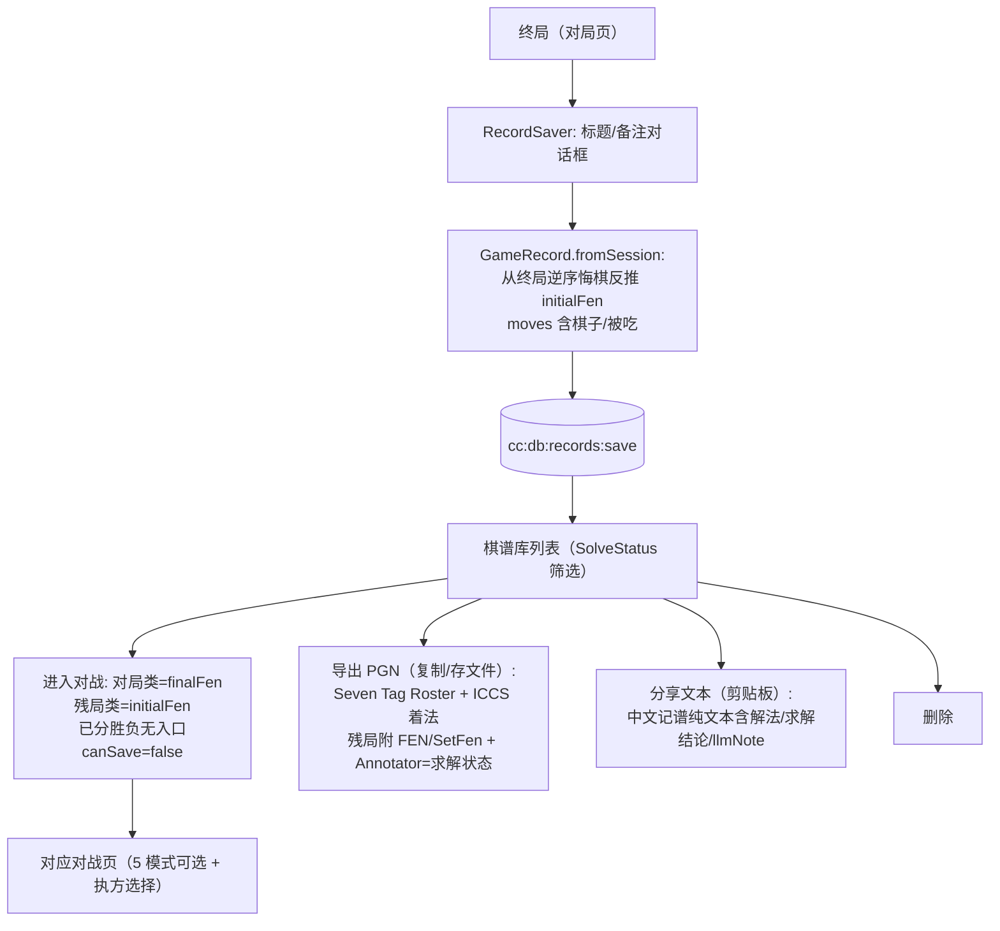

# 07 持久化与状态管理设计

> 对应 Flutter 版 `lib/features/storage/`（447 行）+ `game_auto_save.dart` + `game_restore.dart` + 设置存储。
> 三层存储：SQLite（对局/棋谱）、electron-store（设置/路径）、safeStorage（凭据）。

---

## 1. 数据库（better-sqlite3，主进程）

文件位置：`app.getPath('documents')/chinese_chess_electron.sqlite`（对齐原版 `%USERPROFILE%/Documents/chinese_chess_ultra.sqlite` 语义；可在设置中改名的决策留给实现期）。

### 1.1 表结构（与原版逐字段一致）

```sql
-- 自动存档：每模式只留最近一局
CREATE TABLE saved_games (
  id              INTEGER PRIMARY KEY AUTOINCREMENT,
  mode            TEXT NOT NULL,          -- legacy 兼容列（V1 迁移）
  fen             TEXT NOT NULL,
  move_stack_json TEXT NOT NULL,          -- [[fCol,fRow,tCol,tRow], ...] 裸四元组
  created_at      INTEGER NOT NULL,
  updated_at      INTEGER NOT NULL
);
-- V1 迁移：无 mode 列时补列并标 'legacy'（旧数据任何模式读不到，保持语义）

-- 棋谱库：全量历史
CREATE TABLE game_records (
  id             INTEGER PRIMARY KEY AUTOINCREMENT,
  title          TEXT NOT NULL,
  mode           TEXT NOT NULL,           -- humanVsAi/humanVsHuman/aiVsAi/humanVsLlm/llmVsLlm/endgame
  initial_fen    TEXT NOT NULL,
  moves_json     TEXT NOT NULL,           -- [{f:[c,r], t:[c,r], p:'FEN', x:'FEN|null'}] 含棋子/被吃
  result         TEXT,                    -- redWins/blackWins/draw/…
  solve_status   TEXT,                    -- none/solved/noSolution/timeout
  solutions_json TEXT,                    -- [["b2e2","h0g2",…], …] ICCS 数组的数组
  llm_note       TEXT,                    -- LLM 辅助结论注释
  note           TEXT,
  created_at     INTEGER NOT NULL
);
```

### 1.2 两套存档语义（不可混淆）

| | saved_games（自动存档） | game_records（棋谱库） |
|---|---|---|
| 粒度 | 每模式 1 局（upsert 覆盖） | 无限条 |
| 着法格式 | 裸四元组（无棋子信息） | 含棋子 FEN + 被吃 FEN |
| 恢复方式 | **replay 重放**（跳脏记录） | 直接重放 + 元数据 |
| 模式桶 | 5 个 GameMode（残局闯关不存档） | 全模式 + endgame |

### 1.3 存档 JSON Schema

```jsonc
// move_stack_json（自动存档）
{ "type": "array", "items": { "type": "array", "minItems": 4, "maxItems": 4,
  "items": { "type": "integer" } } }

// moves_json（棋谱库）
{ "type": "array", "items": { "type": "object",
  "properties": {
    "f": { "type": "array", "items": {"type":"integer"}, "minItems":2, "maxItems":2 },  // [col,row] 起
    "t": { "type": "array", "items": {"type":"integer"}, "minItems":2, "maxItems":2 },  // [col,row] 终
    "p": { "type": "string" },   // 走子方棋子 FEN 字符
    "x": { "type": ["string","null"] } // 被吃棋子 FEN 字符
  }, "required": ["f","t","p"] } }
```

旧数据兼容：Flutter 版 sqlite 文件**结构完全相同**，Electron 版可换名直接读取（rename 文件即可迁移）；`isValidFen` 校验复用规则内核。

---

## 2. 自动保存与恢复状态机



**触发时机映射**（Flutter → Electron）：

| Flutter 触发点 | Electron 对应 |
|---|---|
| 页面 `dispose()` | 路由卸载 cleanup（先 saveOnExit 再注销监听） |
| App 生命周期 `paused`（移动端） | 窗口 `blur` |
| App 生命周期 `hidden`（桌面最小化） | `BrowserWindow 'minimize'` 事件 |
| 进程退出 | `before-quit` + `window 'close'`（同步 best-effort 写入） |
| 手动"保存棋局"按钮 | 不受全局开关限制（`saveManual`） |

门控：全局开关 `autoSave`（默认开，electron-store `global_auto_save`）+ 页面级 `canSave` 回调（**棋谱/残局续战来源不写模式存档桶**，防污染）。

恢复终局清理：恢复 replay 完成后检查——**已分胜负视为死局，删除该存档并开新局**（`game_restore.dart:32-37`）。

---

## 3. 设置存储（electron-store）

| Key | 类型 | 默认 | 内容 |
|---|---|---|---|
| `global_auto_save` | bool | true | 自动保存开关 |
| `corpus.userPath` | string | '' | 语料自定义目录 |
| `llm_settings_*` | 见 05 §9 | — | 对局设置（非敏感） |

## 4. 凭据存储（safeStorage 三槽位）

| 槽位 | 内容 | 使用方 |
|---|---|---|
| `llm_config_red` | `{baseUrl, apiKey, model, disableThinking}`（整体 JSON，加密落盘） | LLM 对战红方 |
| `llm_config_black` | 同上 | 人机 LLM 黑方 / LLM 对战黑方 |
| `llm_config_assistant` | 同上 | 求解辅助 + 视觉识图（共用） |

- 主进程：`safeStorage.encryptString(json)` → base64 写 `userData/credentials.enc`；解密反向；解密失败按未配置处理（对齐原版"读失败按未配置"）；
- 渲染层只见掩码 `****` + 末 4 位（`maskedApiKey`）；完整 Key 不进渲染层内存、不进日志；
- 追溯：`llm_config_store.dart:15-52`。

---

## 5. 棋谱联动数据流（保存/导出/进入对战）



追溯：`record_saver.dart`、`record_battle_launcher.dart`、`pgn_writer.dart`、`game_record.dart:89-195`。

---

## 6. React 状态管理方案（Zustand，每局一实例）

### 6.1 与 Flutter 版的关键差异（有意为之的缺陷修复）

Flutter 版 `boardViewModelProvider` 是**全局单例**：所有页面共享同一棋盘，切页互相污染，代码中多处防御（输入锁泄漏 dispose 兜底 `human_vs_ai_page.dart:85`、恢复/新局清场、配置未加载不回写等）。Electron 版改为**每局一个 store 实例**，从结构上消除此类缺陷：

```ts
// 对局 store 工厂：进入页面时创建，离开时销毁
const useGameStore = createGameStore({ mode: 'humanVsLlm', initialFen, playerSide, canSave });
```

### 6.2 Store 清单

| Store | 职责 | 对应 Flutter |
|---|---|---|
| `gameStore`（工厂，每局一实例） | 棋盘状态/onTap/playMove/undo/newGame/resign/serialize + 输入锁 | board_vm.dart |
| `llmGameSettingsStore` | 对局设置（05 §9） | llm_settings.dart |
| `llmConfigStore`（红/黑/助手） | 配置卡状态 + 防抖保存 | llm_config_editor.dart |
| `corpusStore` | 语料扫描/筛选/解析进度（generation 防陈旧） | corpus_browser_vm.dart |
| `puzzleDemoStore` | 演示播放器状态机 | puzzle_vm.dart |
| `globalSettingsStore` | autoSave 开关 | global_settings.dart |

### 6.3 异步编排统一收口

- 所有异步（Worker/IPC）经 `requestId` 管理（00 文档 §3.2）：新局/悔棋/离开页面 = cancel + 迟到响应丢弃；
- 输入锁 `lockInput/unlockInput` 语义不变：AI/LLM 思考期间锁定棋盘，终局/失败/取消必须解锁（dispose 兜底）；
- `onMoved` 仅在历史确实增长后触发（防动画竞态重复触发 AI，对齐 `board_widget.dart:104`）。
