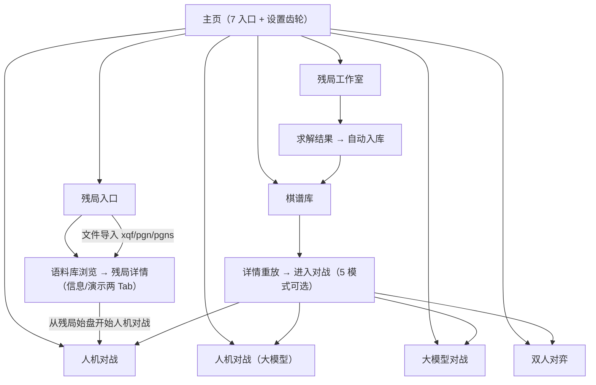
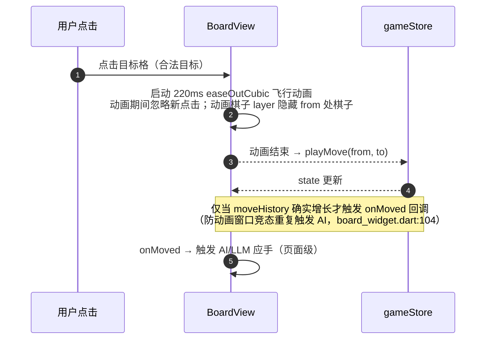
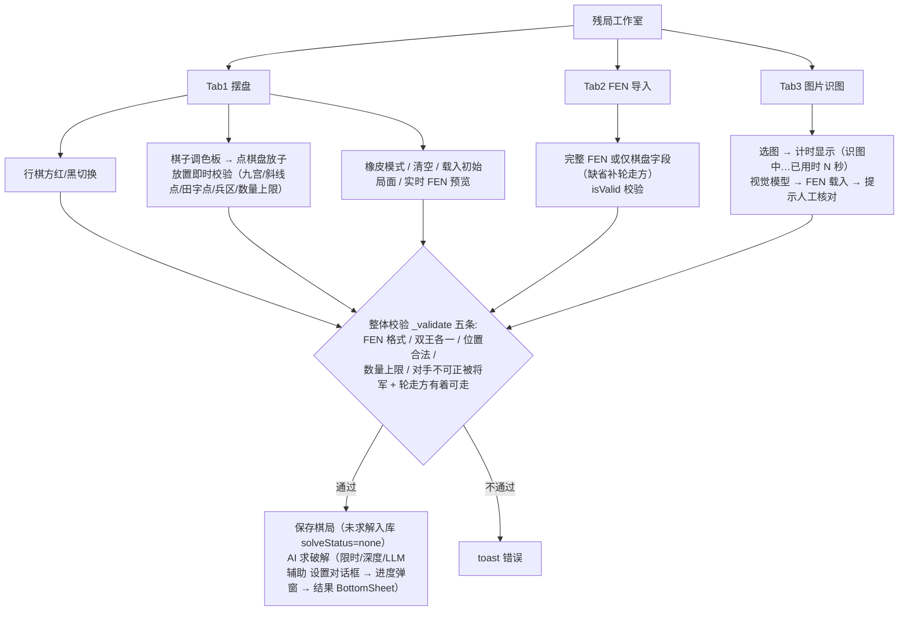
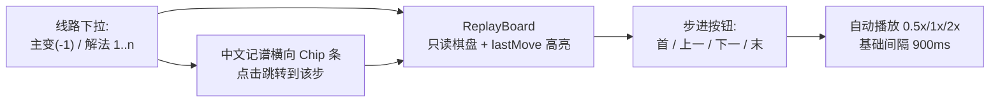

# 08 UI 与交互设计

> 对应 Flutter 版 `lib/features/board/view/` + `app.dart` + 各 feature 视图层（约 5000 行）。
> 渲染选型：**SVG**（棋盘与棋子）——矢量缩放无损、命中检测可用 DOM 事件、动画用 CSS transform（GPU 合成）；比 Canvas 少一套自绘命中/重绘管理，比 DOM 网格性能可控（仅 ~90 节点 + 提示层）。

---

## 1. 页面导航与主题

主页面为垂直按钮列表（对应 `MainNavigationPage`），无全局路由表，React Router 用内存路由（桌面应用）：

| 入口 | 页面 | 说明 |
|---|---|---|
| 残局选关 | PuzzleEntry（文件导入 + 语料库入口） | 原 puzzle_list_page 裁剪后并入 |
| 人机对战 | HumanVsAiPage | 内置 AI 难度 1-5，可执黑 |
| 人机对战（大模型） | HumanVsLlmPage | 玩家执红，黑方 LLM |
| 大模型对战 | LlmVsLlmPage | 红黑双 LLM |
| 双人对弈 | HumanVsHumanPage | 计时器 |
| 残局工作室 | EndgameStudioPage | 摆盘/FEN/识图 + 求解 |
| 棋谱库 | RecordLibraryPage | 重放/导出/进入对战 |
| 右上齿轮 | 全局设置弹窗 | 自动保存开关 |

主题：Material 3 棕色系（colorSchemeSeed `0xFF8D6E63`），字体栈 `['Microsoft YaHei','PingFang SC','serif']`；Electron 版用 CSS 变量保存调色板（棋盘木色 `0xFFF3D9A6`、红子 `0xFFB71C1C` 等，对齐 `lib/shared/constants.dart`）。

---

## 2. 棋盘组件

### 2.1 组件清单

| 组件 | 用途 | 对应 |
|---|---|---|
| `BoardView`（交互） | 对战页主棋盘：点击选中/走子/动画 | board_widget.dart |
| `BoardViewStatic` | 只读棋盘：工作室摆盘、残局演示 | static_board_widget.dart、demo_board_widget.dart |
| `SidePanel` | 回合指示（含"将军！"）、结果横幅、悔棋/新游戏按钮、走法记录双列列表 | side_panel.dart |
| `LlmConfigCard` | 单侧 LLM 配置卡（预设下拉/URL/Key 掩码/模型/思维链开关/测试连接） | llm_config_editor.dart |
| `MoveRecordsList` | 双列回合制红/黑中文记法 | side_panel.dart:178 |

### 2.2 走子动画时序（竞态防护必须 1:1 保留）

### 2.3 命中与布局

- 布局算法对齐 `board_layout.dart`：`cell = min(width/8.6, height/9.6)`；绘制/命中/动画共用同一几何；
- SVG 结构：棋盘线层（河界"楚河汉界"、九宫斜线）→ 棋子层 → 高亮层（选中/合法目标/lastMove）→ 动画层；
- 响应式：竖屏（棋盘上/面板下）与横屏（左棋盘/右面板）断点。

---

## 3. 各对战页信息区与操作

### 3.1 人机对战（内置 AI）
- 难度下拉（初级~大师）、执方（执红默认/执黑——AI 先行）；
- 状态栏四态：对局结束 / AI 思考中（spinner）/ 被将军 / 等待玩家；
- 按钮：新游戏（AppBar+面板）、悔棋（undoRound 整轮）、保存棋局（非残局来源）、保存为棋谱；
- 残局模式：开局轮 AI 自动先行；胜负弹通关/惜败对话框（防重入）。

### 3.2 双人对弈
- 计时器 `mm:ss`（每秒累计、终局暂停）、当前回合红/黑着色、将军提示、步数、用时；
- 按钮：新游戏、悔棋（单手）、保存棋局、分享棋局（剪贴板）、保存为棋谱、"显示走法记录"开关。

### 3.3 人机对战（大模型）
- LlmConfigCard（黑方）+ 对局设置区：空闲超时 30/60/120/180/300s、重试 1/3/5、降级策略（内置 AI 代走/判负）、参谋模式（关/候选/护航）+ 参谋强度 0-100 滑杆 + 参谋深度（2/4/6 层）；改动 800ms 防抖保存；
- 状态栏显示：模型"分析:"思路 / 参谋评分分桶 / 否决说明 / 兜底提示 / 错误说明；
- 配置未加载完成前不回写（防空配置覆盖 Key）。

### 3.4 大模型对战
- 左右双 LlmConfigCard；走棋间隔 0/1/2/5s；参谋模式红黑各自独立强度；
- 控制按钮：开始/暂停/继续（同一按钮）、停止、新游戏、保存为棋谱；
- 状态区：主状态 + 红方思路 + 黑方思路 + 最后着法中文记法；棋盘全自动无点击。

---

## 4. 残局工作室（三 Tab）

结果 BottomSheet 内容：状态图标+文案（唯一解 / N 条破解走法 / 无解（N 半着内已证明）/ 限时内未找到）、用时与入库成败、LLM 注释、"对方已被将死无需再走"特例、每条解法中文记谱线路。识图单次超时 120s × 最多重试 2 次。

---

## 5. 棋谱库与重放器

### 5.1 列表页
- SolveStatus ChoiceChip 筛选（全部/已解/无解/超时/未求解）；
- 每条菜单：进入对战 / 导出 PGN（复制）/ 分享文本（复制）/ 导出 PGN 文件（saveFile 对话框）/ 删除。

### 5.2 详情页重放器（ReplayBoardView）

元信息卡：标题/模式/日期/红黑方名/结果/求解状态/备注/llmNote。

---

## 6. 全局设置弹窗

仅"自动保存棋局"开关（改动即写 electron-store `global_auto_save`）；每次打开重新读取（对齐原版"每次打开前重新 load"防多入口失步）。

---

## 7. 交互防错清单（迁移时逐项验收）

| # | 防错点 | 来源 |
|---|---|---|
| 1 | 动画期间忽略点击；只有历史增长才触发 AI | board_widget.dart:42,104 |
| 2 | 输入锁：AI/LLM 思考期间锁定；dispose/失败/取消必须解锁 | board_vm.dart:140,220、human_vs_ai_page.dart:85 |
| 3 | 新游戏确认对话框；终局横幅后忽略点击 | side_panel.dart:70 |
| 4 | LLM 配置未加载完成不回写；copyWith 只覆盖本页字段防清空共享设置 | human_vs_llm_page.dart:68,221 |
| 5 | 恢复存档已分胜负 → 删存档开新局 | game_restore.dart:32 |
| 6 | 棋谱来源对战 canSave=false 不写模式存档 | record_battle_launcher.dart |
| 7 | 走子失败 resign 显式写入胜负防软死锁 | human_vs_llm_page.dart:624、llm_vs_llm_page.dart:761 |
| 8 | 演示走子数据与局面不一致跳过该步 | puzzle_vm.dart:165-184 |
| 9 | 语料解析 generation 计数防旧任务覆盖 | corpus_browser_vm.dart:204 |
| 10 | 结果对话框防重入 | human_vs_ai_page.dart:400 |
