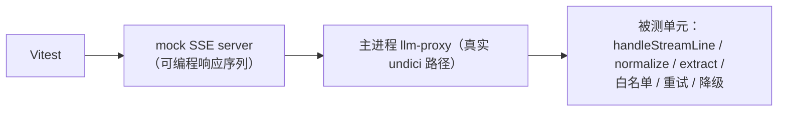

# 09 测试方案

> 目标：`packages/*`（纯 TS 层）测试覆盖对齐 Flutter 版 39 个测试文件 / 约 289 个用例的等价集；Electron 特有层（IPC/Worker/代理）用集成测试补齐。
> 框架：Vitest（单测/集成）+ Playwright（E2E）。

---

## 1. 用例映射总表（Flutter → Vitest）

| Flutter 测试 | 用例数 | Electron 对应测试 | 说明 |
|---|---|---|---|
| board/model board_test | 17 | `test/rules/board.spec.ts` | 走法生成/蹩腿/象眼/炮架/照面/过河兵/将死/困毙 |
| board/model fen_test | 5 | `test/rules/fen.spec.ts` | 解析/校验/编解码 |
| board viewmodel board_vm_test | 12 | `test/stores/gameStore.spec.ts` | onTap/playMove/undoRound/restore/resign |
| human_vs_ai / human_vs_llm / record_linkage 页面测试 | 6+10+4 | `test/pages/*.spec.ts`（组件级，mock IPC/Worker） | 页面状态机 |
| board_painter_test | 3 | `test/ui/boardView.spec.tsx`（Testing Library） | 高亮/选中渲染 |
| corpus_downloader | 11 | `test/services/downloader.spec.ts` | SSRF/魔数/zip-slip/原子替换（mock fs+fetch） |
| corpus_scanner | 11 | `test/parsers/scanner.spec.ts` | 分类聚合/批量解析 |
| iccs | 7 | `test/parsers/iccs.spec.ts` | 换算（row=9−rank）/宽松解析 |
| puzzle_parser | 7 | `test/parsers/puzzleParser.spec.ts` | 分发/重放校验/去重 |
| pgn_parser | 12 | `test/parsers/pgn.spec.ts` | 中文消解/变着删除/流式索引 |
| xqf_parser | 7 | `test/parsers/xqf.spec.ts` | 解密/置换/GB18030/缺将报错 |
| puzzle_vm / corpus_browser_vm | 9+3 | `test/stores/puzzleDemo.spec.ts` 等 | 播放状态机/generation 防陈旧 |
| game_record / dao / pgn_writer / launcher / detail / library / saver | 8+6+7+7+4+5+4 | `test/storage/*.spec.ts`（better-sqlite3 内存库） | 存档/棋谱/导出/联动 |
| ai_engine / ai_engine_ex | 5+6 | `test/engine/chessAi.spec.ts` | 搜索/难度/报告真实分差 |
| hybrid_llm_move_source | 7 | `test/llm/hybrid.spec.ts` | 三模式/否决链/兜底 |
| llm_move_source | **30** | `test/llm/moveSource.spec.ts` | SSE 解析/五层过滤/重试/降级（mock SSE 流） |
| llm_prompt_v2 | 7 | `test/llm/promptV2.spec.ts` | 提示词逐字快照测试 |
| llm_settings / move_annotation | 4+6 | `test/llm/settings.spec.ts` 等 | clamp/分桶/注解 |
| vision_board_reader | 15 | `test/llm/vision.spec.ts` | JSON 提取/双王校验/MIME |
| endgame_solver | 6 | `test/solver/solver.spec.ts` | 6 个内置验证 FEN |
| endgame_studio / board_setup_rules | 10+7 | `test/studio/*.spec.ts` | 摆盘规则/校验五条/入库 |
| app / app_entries | 冒烟 | `e2e/smoke.spec.ts` | Playwright 启动冒烟 |

---

## 2. 专项测试

### 2.1 规则引擎对拍（金标准）

1. **Dart 版已知对局**：取 Flutter 版测试中的确定性 FEN 与期望走法列表，硬编码为金标准——TS 版 `allLegalMoves` 输出**必须逐条一致**（顺序无关、集合相等）；
2. **FEN 往返**：`fromFen(f).toFen() === f` 遍历金标准 FEN 集；
3. **中文记法快照**：`炮二平五/马8进7/兵五进一` 等逐字快照。

### 2.2 引擎/求解器对拍

- `findBestMoveEx`：固定 FEN 上 best/topK 分数与 Dart 版一致（全窗口真实分差 → 跨语言可复现）；
- 求解器：6 个内置验证 FEN（多解/无解/超时/已将死/非法/缺王，docs/phase4/03）结果一致；
- 性能门：难度 5 应答 ≤ 7.5s（5s × 1.5 容差，见 03 §8）；
- **重复检测机制的口径注记（DR-018）**：本节全部对拍期望在**不传 `historyFens`** 的前提下不变——该参数缺省时引擎与 Dart 口径逐位一致；Zobrist/L1/L2/L3 的专属测试见 built-in-ai-move-repetition-optimization-design-final.md §7。

### 2.3 LLM 管线（mock SSE 服务器）



必须覆盖的失败模式（对齐原版 docs/llm_interaction.md §6 表）：

| 模拟场景 | 期望 |
|---|---|
| 正常增量 + [DONE] | 提取成功 |
| markdown 围栏/全角/零宽字符包裹 | 归一化后提取成功 |
| 多坐标对 + 「着法:」标记 | 标记后优先 |
| 思维链正文空 | 退回 reasoning 提取 |
| 编造清单外着法 | 重试，反馈含原因 |
| 连续 maxAttempts 次无效 | 降级 builtinAi（note）/resign（failed） |
| HTTP 4xx/5xx | 重试耗尽 → 降级 |
| 空闲超时/总上限 | LlmApiException → 重试 |
| 翻译模型报错 | annotateModelHint 提示 |
| 候选模式编造非 Top-K | 不在池 → 重试 |
| gate 否决→再问→二次通过/二次违抗 | 引擎最佳代走，note 正确，不走 resign 分支 |

### 2.4 Worker / IPC 集成

- engine.worker：postMessage 协议 roundtrip、取消（cancel 后响应 discarded）、迟到响应按 id 丢弃；
- llm-proxy：SSE 转发块序完整、空闲计时器重置、总上限触发、cancel → AbortController；
- db：better-sqlite3 内存库建表/迁移 V1/upsert 覆盖/死局清理。

### 2.5 E2E（Playwright）

冒烟链路：启动 → 主页 7 入口可见 → 双人走一着（点击棋盘）→ 悔棋 → 新游戏 → 棋谱库打开。LLM/E2E 一律 mock（不依赖外部服务）。

---

## 3. 测试目录与工具约定

```text
test/
├── rules/ engine/ solver/ parsers/ llm/ storage/ stores/ studio/ pages/ ui/
e2e/
tools/
├── mock-llm-server.mjs     # 可编程 SSE mock（npm run test:llm 启动）
└── golden/                 # 金标准 FEN/走法/记法/样例 xqf+pgn（自 assets/puzzles 复制）
```

- `packages/*` 测试**不经 Electron**（Node 直跑，快）；主进程服务用 Vitest 集成模式；
- 快照测试仅用于提示词/PGN 导出/JSON 报告三类"协议面"，改动必须显式 review 快照 diff。

## 4. 质量门（CI，对齐原版门槛）

| 门 | 标准 |
|---|---|
| Lint/Type | tsc --noEmit 0 error；eslint 0 error |
| 单测 | 全量 Vitest 通过（含金标准对拍） |
| LLM 管线 | mock SSE 全场景通过（30 用例等价集 + 新增 Electron 层） |
| 构建 | electron-builder 三平台产物可启动（CI 矩阵） |
