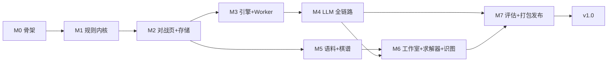

# 10 实施路线图

> 里程碑按依赖排序：规则内核是一切的地基；引擎/求解器只依赖内核；LLM 依赖引擎（参谋）；语料/棋谱依赖内核；工作室/识图依赖求解器 + LLM。

---

## 1. 里程碑

| 里程碑 | 内容 | 验证门 | 依赖 |
|---|---|---|---|
| **M0 工程骨架** | monorepo 初始化（electron + vite + TS strict + Vitest + eslint）；WSLg dev 环境跑通；IPC mock 层；CI 骨架（lint+tsc+空测试） | `npm run dev` 在 WSLg 弹窗；浏览器模式可开发 | — |
| **M1 规则内核** | `packages/rules`（Board/FEN/走法/胜负/记法/坐标） | 17+5 规则用例 + 金标准对拍全绿；FEN 往返 | M0 |
| **M2 对战页 + 存储** | 双人页（棋盘 SVG/动画/侧栏）+ gameStore + better-sqlite3 + 自动保存/恢复 + 主页导航 | 双人完整对局；存档恢复/死局清理 E2E | M1 |
| **M3 引擎 + Worker** | `packages/engine` + engine.worker + ChessAiPlayer + 人机对战页（难度/执黑/悔棋轮） | 难度 1-5 应答；性能门 ≤7.5s（难度5）；对拍 | M2 |
| **M4 LLM 全链路** | 主进程 llm-proxy（SSE）+ packages/llm（Prompt/解析/参谋制）+ 人机 LLM 页 + LLM vs LLM 页 + 配置卡 + safeStorage | mock SSE 全场景；真实端点手测一局；否决链用例 | M3 |
| **M5 语料 + 棋谱** | packages/parsers（XQF/PGN/ICCS）+ parser.worker + 语料库页 + 下载器 + 棋谱库/重放/导出/进入对战 | 样例文件解析；41743/99813 局索引分页；PGN 导出快照 | M2（棋谱）/M1（解析） |
| **M6 工作室 + 求解器 + 识图** | solver.worker + 工作室三 Tab + 求解结果/入库 + LLM 求解辅助 + 视觉识图 + 残局详情演示播放器 | 6 个验证 FEN；识图人工校正流；联动对战 | M4/M5 |
| **M7 评估 + 打包发布** | MatchRunner CLI（npm run eval）+ electron-builder 三平台 + better-sqlite3 rebuild + CI 矩阵 + Release | 四 profile 对比报告可产出；三平台安装包启动冒烟 | 全部 |

---

## 2. 里程碑流程与验证门

每个验证门 = 09 文档质量门四项全过（lint/tsc/单测/构建）+ 该里程碑专属验收用例。

---

## 3. 风险表

| # | 风险 | 影响 | 缓解 |
|---|---|---|---|
| R1 | better-sqlite3 原生模块跨 Electron ABI 需 rebuild；WSL 内交叉打包 Windows 产物困难 | M2/M7 | dev 用 `electron-rebuild`；Windows 产物由 CI Windows runner 打；本地只打 Linux |
| R2 | TS 引擎性能不达 Dart 版（深度 6 >7.5s） | M3 | Int8Array 一维棋盘 + 零分配走法生成（03 §8）；仍不达则该难度时间上限下调，接口不变；预留 napi-rs 替换（DR-003） |
| R3 | 渲染层 CORS/凭据泄漏 | M4 | 全部外呼走主进程代理（DR-004）；Key 仅 safeStorage；CSP connect-src 'self' |
| R4 | SSE 转发经 IPC 的背压/粘包 | M4 | 主进程按行缓冲再转发整块；requestId 关联；空闲计时器只在主进程侧 |
| R5 | 大语料（97MB PGN / 2911 XQF）解析卡 UI | M5 | 流式按局索引 + parser.worker 分批 128 + generation 防陈旧 |
| R6 | XQF 解密实现偏差（版本≥12 置换/注解长度 keyRmkSize） | M5 | 用 2911 个真实文件做批量解析回归（解析失败率 ≤ Dart 版） |
| R7 | WSLg 环境差异（GPU 加速/托盘） | M0 | dev 允许 `--disable-gpu`；浏览器 mock 模式兜底 |
| R8 | 规则缺口（长将/重复判和）在 LLM 对战中的循环死锁 | M4 | 保持原版行为：仅 prompt 警示 + 引擎兜底，不引入新规则（02 §6） |

---

## 4. 分支与提交策略

- `main` 保护，里程碑分支 `feature/m3-engine-worker` 模式（对齐原版 phase 分支习惯）；
- 每里程碑结束合入 main 并打 tag（`v0.3.0-m3`）；
- 决策记录（decision_log.md）随对应实现同一 commit 提交（`Decision: DR-xxx` 尾行）。

## 5. 验收基线（Definition of Done for v1.0）

1. 01 文档 E-F01~F42 全部功能可用（含 0.3 可裁剪项的评审结论）；
2. 09 文档质量门全绿 + 三平台安装包；
3. 真实 LLM 端点手测：人机 LLM 一整局 + LLM vs LLM 一整局 + 求解辅助一次 + 识图一次；
4. MatchRunner 四 profile 报告可复现（与原版结论同数量级：候选/护航模式失误率 ≈0%）。
