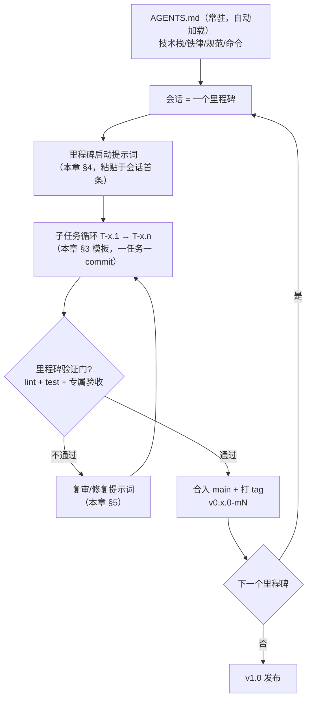

# 11 开发执行手册：AI 提示词全集与任务拆解

> 本手册回答两个问题：①如何给 AI 编码代理下达指令让它按 design_docs 开发；②如何把 M0~M7 拆成可独立执行、可独立验收的子任务。
> 使用机制：`AGENTS.md`（项目根）是每个会话自动读取的常驻指令；本章的**里程碑启动提示词**在每个里程碑开新会话时粘贴；**子任务提示词**按模板填充执行。

---

## 1. 执行模型总览



**会话纪律**（上下文管理的关键）：

1. **一个里程碑一个全新会话**——不要在同一个会话里连做两个里程碑，防止上下文稀释导致铁律遗忘；
2. 会话首条消息 = 里程碑启动提示词（本章 §4 对应节），不要粘贴设计文档全文——用"读 `design_docs/xx` 的 §y"引用，代理会自己读；
3. 里程碑内子任务**串行执行**（每任务一个 commit，测试绿了再做下一个）；只有明确标注"可并行"的任务才在两个会话中并行（见 §2 并行标注）；
4. 任何会话中代理提出改变架构/协议的想法 → 停下，按协作约定走决策记录（DR-00x）。

---

## 2. 任务拆解总表（M0~M7，40 个子任务）

> 依赖列 = 前置任务；"并行"列 ✓ 表示与其他任务无文件交集，可双会话并行。
> 每个任务的验收标准 = `AGENTS.md` 质量门 + 表中"专属验收"。

### M0 工程骨架

| 编号 | 任务 | 产出 | 专属验收 | 并行 |
|---|---|---|---|---|
| T0.1 | monorepo 初始化 | electron + vite + TS strict + eslint + vitest + 目录骨架（00 文档 §4） | `npm run dev` WSLg 弹窗；`dev:web` 浏览器可开 | — |
| T0.2 | IPC 契约与 mock 层 | preload 类型化 `window.api` + 00 文档 §3.1 全部通道的 TS 类型 + 浏览器 mock 实现 | mock 层下 dev:web 无报错；通道类型单测编译通过 | ✓（与 T0.3） |
| T0.3 | CI 骨架 | GitHub Actions：lint + tsc + 空测试矩阵（三平台） | CI 全绿 | ✓ |

### M1 规则内核（packages/rules）

| 编号 | 任务 | 产出 | 专属验收 | 并行 |
|---|---|---|---|---|
| T1.1 | 类型与 FEN | Position/Piece/Move/Board 骨架 + FEN 编解码（02 §1） | FEN 往返金标准 5 用例 | — |
| T1.2 | 走法生成 | 7 棋种 pseudoMovesFor（02 §2.1 规则表逐条） | 17 条 board 用例的走法部分 | — |
| T1.3 | 合法性与胜负 | legalMovesFor 自将过滤 + isCheck（含照面）/checkmate/stalemate | 将死/困毙/照面负例用例 | — |
| T1.4 | 中文记法 | chineseNotation 三分支（02 §4） | 记法快照用例 | ✓（与 T1.3） |
| T1.5 | 金标准对拍集 | 09 §2.1 金标准 FEN/走法/记法全集落盘 `tools/golden/` | 集合相等断言全绿 | — |

### M2 对战页 + 存储

| 编号 | 任务 | 产出 | 专属验收 | 并行 |
|---|---|---|---|---|
| T2.1 | 主进程 DB | better-sqlite3 建表/V1 迁移/DAO（07 §1） | 内存库 14 条 DAO 用例等价集 | ✓（与 T2.3） |
| T2.2 | 主进程设置与凭据 | electron-store + safeStorage 三槽位（07 §3/§4） | 掩码不泄 Key；读失败按未配置 | — |
| T2.3 | 棋盘组件 | BoardView SVG + 220ms 动画 + 命中（08 §2） | 动画竞态 3 用例（08 防错 #1） | ✓ |
| T2.4 | gameStore | Zustand 工厂：onTap/playMove/undo/undoRound/newGame/resign/restore（02 §5） | board_vm 12 用例等价集 | — |
| T2.5 | 自动保存/恢复 | 生命周期挂接（07 §2 映射表）+ 死局清理 | 保存恢复状态机全路径 | ✓ |
| T2.6 | 双人页 + 主页导航 | HumanVsHuman + 计时器 + 主页 7 入口 | 08 防错 #1~#6 手测 | — |

### M3 引擎 + Worker

| 编号 | 任务 | 产出 | 专属验收 | 并行 |
|---|---|---|---|---|
| T3.1 | 引擎核心纯函数 | 评估/排序/negamax/quiescence（03 §3/§4） | 单元用例（固定 FEN 分数） | — |
| T3.2 | 迭代加深与三接口 | findBestMove/findBestMoveEx/evaluateMove（03 §5） | Dart 对拍：best 与 topK 分数一致；性能门 ≤7.5s | — |
| T3.3 | engine.worker | Worker 协议 + 取消 + 迟到丢弃（03 §6） | 集成测试：cancel/迟到丢弃 | — |
| T3.4 | 人机对战页 | ChessAiPlayer + 难度/执黑/undoRound/状态栏四态 | 6 条 human_vs_ai 用例等价集 | — |
| T3.5 | 重复优化设计文档 | final 设计文档 + DR-018/019 + 五处文档挂接 | 决策记录齐全、口径注记落位 | — |
| T3.6 | Zobrist 哈希 | zobrist.ts + EngineBoard 增量键（DR-019） | 增量===重建对拍 + apply/undo 往返 | — |
| T3.7 | L1 搜索内重复检测 | search.ts 路径栈 + 阶梯惩罚 + ply≤3 全局检查 | 长将局面避开循环线；nodeCount 差 ≤5% | — |
| T3.8 | L2 根节点历史回避 | chessAi 阈值/系数/两阶段 + historyFens 协议 + VM fenHistory | 命中历史换着；不传参数逐位等价旧版 | — |
| T3.9 | L3 规则裁决 | repetitionJudge 纯函数 + gameVm.agreeDraw（DR-018） | 10 场景金标准（长将/判和/强制和/悔棋重算） | — |
| T3.10 | UI 重复裁决接线 | useRepetitionJudge hook + 四对局页 | 08 防错 #11/#12 手测 | — |

### M4 LLM 全链路

| 编号 | 任务 | 产出 | 专属验收 | 并行 |
|---|---|---|---|---|
| T4.1 | llm-proxy | undici SSE + 空闲/总上限计时器 + cancel（05 §3） | mock SSE 服务器集成测试（块序/超时/取消） | ✓（与 T4.2） |
| T4.2 | 提示词与解析器 | packages/llm：Prompt v1/v2 逐字 + LlmMoveParser（05 §2/§4） | **快照测试**（提示词逐字）+ 30 条解析用例 | ✓ |
| T4.3 | LlmPlayer | 重试/降级/测试连接/错误提示翻译（05 §4） | 失败模式表全场景（09 §2.3） | — |
| T4.4 | 参谋制 HybridLlmPlayer | 三模式 + 否决链 + 兜底（05 §5） | 7 条 hybrid 用例等价集 + 否决分支 | — |
| T4.5 | 人机 LLM 页 | 配置卡 + 设置区 + 状态栏（08 §3.3） | 10 条 human_vs_llm 用例等价集 | — |
| T4.6 | LLM vs LLM 页 | 对局循环/暂停/独立强度（05 §8.1） | 循环/暂停/失败判负用例 | — |
| T4.7 | 真实端点手测 | （人工）GLM 或 DeepSeek 各一整局 | 05 结论同数量级：无编造着法失败 | — |

### M5 语料 + 棋谱

| 编号 | 任务 | 产出 | 专属验收 | 并行 |
|---|---|---|---|---|
| T5.1 | ICCS + PGN 解析 | iccs.ts + pgn_parser（06 §2/§4） | 7+12 用例等价集（中文消解/变着） | ✓（与 T5.2） |
| T5.2 | XQF 解析 | xqf_parser 解密/置换/GB18030（06 §3） | 7 用例等价集 + 样例文件 | ✓ |
| T5.3 | 解析门面 | puzzle_parser 重放校验/去重/难度（06 §4.5） | 7 用例等价集 | — |
| T5.4 | parser.worker + 语料库页 | 分批 128 + 进度 + 筛选排序（06 §6） | scanner 11 用例等价集 | — |
| T5.5 | 下载器 | 主进程 downloader + 安全设计（06 §5） | 11 条 downloader 用例（SSRF/zip-slip mock） | ✓ |
| T5.6 | 棋谱库 | dao/pgn_writer/replay/launcher/列表详情（07 §5） | 34 条 record 用例等价集 + 导出快照 | — |

### M6 工作室 + 求解器 + 识图

| 编号 | 任务 | 产出 | 专属验收 | 并行 |
|---|---|---|---|---|
| T6.1 | solver.worker | AND/OR 求解器 + isWinningFirstMove（04 全部） | 6 个验证 FEN 全过 | — |
| T6.2 | 工作室摆盘 | 三 Tab + 摆盘规则集 + 整体校验（08 §4） | setup_rules 7 + studio 10 用例 | — |
| T6.3 | 视觉识图 | vision_board_reader + 助手配置弹窗（05 §7） | 15 条 vision 用例（mock 多模态） | ✓（与 T6.2） |
| T6.4 | 求解辅助 + 结果入库 | LlmSolveAssist + BottomSheet + 自动入库（04 §8） | solve_assist 用例 + 入库状态机 | — |
| T6.5 | 残局详情演示 | 播放器状态机 + 速度控制（06 §7） | puzzle_vm 9 用例等价集 | ✓ |

### M7 评估 + 打包发布

| 编号 | 任务 | 产出 | 专属验收 | 并行 |
|---|---|---|---|---|
| T7.1 | MatchRunner CLI | 无 UI 运行器 + JSON 报告 + 4 profile（05 §8.2） | 与内置 AI 一局跑通，报告字段齐全 | — |
| T7.2 | 打包 | electron-builder 三平台 + better-sqlite3 rebuild + CI 矩阵 | 三平台安装包启动冒烟 | — |
| T7.3 | E2E + 发布 | Playwright 冒烟链路 + Release 流程 | 09 §2.5 链路全过 | — |

---

## 3. 子任务提示词模板（每次粘贴一条）

```text
【任务】T3.2 迭代加深与三接口
【必读】design_docs/03-内置AI引擎设计.md 全文；AGENTS.md 铁律 #1/#7
【范围】在 src/packages/engine/ 实现 findBestMove / findBestMoveEx / evaluateMove
  （迭代加深 + 超时返回上一层完整结果 + 根节点全窗口，03 文档 §5 语义逐条落实）
【先写测试】test/engine/chessAi.spec.ts：先落金标准用例（design_docs/09 §2.2），
  固定 FEN 的 best/topK 分数必须与文档给出的 Dart 版参考值一致，红测后实现
【验收】npm run lint + npm test 全绿；性能门：难度 5 应答 ≤ 7.5s（写一个 @slow 用例计时）
【禁止】改 packages/rules 任何文件；引入新依赖；把 Worker 代码写进本任务（属 T3.3）
【提交】test(m3): 金标准用例 → feat(m3): 迭代加深与三接口
```

要点：范围/先写测试/验收/禁止/提交五段齐全；**"禁止"段是防越界的关键**——它把拆解边界变成硬约束。

---

## 4. 里程碑启动提示词（每里程碑开新会话时粘贴）

### 4.1 通用骨架

```text
开始执行里程碑 M{n}（{名称}）。
1. 先读 AGENTS.md（常驻铁律）与 design_docs/10-实施路线图.md 中 M{n} 一节；
2. 按设计手册 §2 任务表顺序执行 T{n}.1 ~ T{n}.{k}，每个子任务用
   design_docs/11-开发执行手册.md §3 的五段模板展开，一任务一 commit；
3. 全部子任务完成后跑里程碑验证门，输出验收报告（通过项/偏差/遗留）。
```

### 4.2 M0 工程骨架（完整提示词，可直接粘贴）

```text
开始执行里程碑 M0（工程骨架）。
1. 读 AGENTS.md 与 design_docs/00-总体架构与技术选型.md（§4 目录结构、§3 IPC 协议、§6 WSL 工作流）；
2. 按 design_docs/11-开发执行手册.md §2 的 M0 任务表执行：
   T0.1 monorepo 初始化（electron-vite + TS strict + eslint + vitest，目录按 00 §4）；
   T0.2 preload 类型化 window.api + 00 §3.1 全部 cc:* 通道的 TS 类型定义 + 浏览器 mock 层；
   T0.3 GitHub Actions CI（lint + tsc + 空测试，三平台矩阵）。
   每个子任务先产出五段式计划（范围/测试/验收/禁止/提交）再动手。
3. 验收：WSL 内 npm run dev 能经 WSLg 弹出空窗口；npm run dev:web 浏览器可开；
   npm run lint + npm test 全绿；CI 全绿。
4. 注意：本机是 WSL ubuntu2604，普通命令直接执行，提权命令必须经
   /usr/local/bin/zcode-run 包装；项目路径 /home/ssy/proj/chinese_chess_electron。
```

### 4.3 M1 规则内核（完整提示词，可直接粘贴）

```text
开始执行里程碑 M1（规则内核）。
1. 读 AGENTS.md 与 design_docs/02-规则内核设计.md 全文、09-测试方案.md §1/§2.1；
2. 按 T1.1→T1.5 顺序执行（T1.3 与 T1.4 可并行会话）：类型与 FEN → 7 棋种走法生成 →
   合法性过滤与胜负判定 → 中文记法 → 金标准对拍集落盘 tools/golden/。
   铁律：02 §6 规则缺口（长将/重复判和/自然限着/halfMove）本期不实现；
   所有规则行为以 02 文档为准，不确定处查 01 文档的 Flutter 锚点再读原版源码。
3. 验收：FEN 往返、17 条走法用例、将死/困毙/照面负例、记法快照全绿；
   packages/rules 内 0 个 DOM/Node import（grep 验证）。
```

### 4.4 M2 对战页 + 存储

```text
开始执行里程碑 M2（对战页 + 存储）。读 AGENTS.md、07-持久化与状态管理设计.md 全文、
08-UI与交互设计.md §1~§3。按 T2.1→T2.6 顺序（T2.1 与 T2.3、T2.5 可并行会话）：
DB（07 §1 两表 Schema + V1 迁移）→ 设置与凭据（safeStorage 三槽位）→ 棋盘组件
（SVG + 220ms 动画，08 §2.2 时序逐条落实）→ gameStore（每局一实例工厂，铁律 #6）→
自动保存/恢复（07 §2 生命周期映射 + 死局清理）→ 双人页与主页导航。
验收：DAO 14 用例、board_vm 12 用例、动画竞态用例全绿；手测 08 §7 防错清单 #1~#6。
```

### 4.5 M3 引擎 + Worker

```text
开始执行里程碑 M3（引擎 + Worker）。读 AGENTS.md、03-内置AI引擎设计.md 全文、
09-测试方案.md §2.2。按 T3.1→T3.4 顺序：评估/排序/negamax/quiescence 纯函数 →
迭代加深与 findBestMove/findBestMoveEx/evaluateMove（先金标准红测，Dart 参考分必须一致）→
engine.worker（协议 {id,type,payload}，取消 + 迟到丢弃）→ ChessAiPlayer 与人机对战页。
铁律：引擎在 packages/engine 且零环境依赖（#1）；findBestMoveEx 根节点强制全窗口
（真实分差是否决阈值的前提，03 §5.1）；Worker 初始化失败回退同步计算。
验收：对拍全绿；性能门难度 5 ≤7.5s；人机对局完整可玩（手测）。
```

### 4.6 M4 LLM 全链路

```text
开始执行里程碑 M4（LLM 全链路）。读 AGENTS.md、05-大模型集成设计.md 全文、00 §3 IPC 表。
按 T4.1→T4.7 顺序（T4.1 与 T4.2 可并行会话）：主进程 llm-proxy（undici SSE，空闲超时=块间
最大间隔、总上限=空闲×4，计时器只在主进程侧）→ packages/llm 提示词与解析器
（05 §2 提示词逐字快照测试先行，铁律 #2：禁止意译改写）→ LlmPlayer 重试降级 →
HybridLlmPlayer 三模式与否则决链（K=3+blend/20，阈值=80+3.2×blend，否决代走不走 resign 分支）→
人机 LLM 页与配置卡 → LLM vs LLM 循环 → 真实端点手测。
验收：mock SSE 失败模式表（09 §2.3）全绿；白名单精确匹配（铁律 #3）；
渲染层 0 个外部 fetch（grep 验证）。
```

### 4.7 M5 语料 + 棋谱

```text
开始执行里程碑 M5（语料 + 棋谱）。读 AGENTS.md、06-语料库与棋谱解析设计.md 全文、07 §1/§5。
按 T5.1→T5.6 顺序（T5.1/T5.2/T5.5 可并行会话）：ICCS（row=9−rank，与 LLM 坐标系区分）→
PGN（中文记谱前后中消解 + 变着删除 + 流式索引）→ XQF（解密公式/FKeyBytes/版本≥12 置换，
iconv-lite 解 GB18030）→ 解析门面（重放校验截断）→ parser.worker 分批 128 + 语料库页 →
下载器（SSRF/魔数/zip-slip/staging 原子替换，安全清单 06 §5 逐条）→ 棋谱库全家桶。
验收：对应等价用例全绿；样例 xqf/pgn 解析通过；PGN 导出快照；99813 局索引文件可分页浏览。
```

### 4.8 M6 工作室 + 求解器 + 识图

```text
开始执行里程碑 M6（工作室 + 求解器 + 识图）。读 AGENTS.md、04-残局求解器设计.md 全文、
05 §6/§7、08 §4。按 T6.1→T6.5 顺序：solver.worker（AND/OR + 置换表 + 路径去重 +
isWinningFirstMove，6 个验证 FEN 先红测）→ 工作室摆盘/FEN/识图三 Tab（摆放规则集逐条）→
视觉识图（JSON 强约束 → 双王硬校验 → 人工核对强制，非流式 120s×2）→ 求解辅助 Hybrid
（LLM 提议 → 求解器验证 → 通过才入 llmNote）→ 三种求解结论全部自动入库 → 残局演示播放器。
验收：04 状态机全路径；6 个 FEN 全过；识图管线用例；联动对战 canSave=false。
```

### 4.9 M7 评估 + 打包发布

```text
开始执行里程碑 M7（评估 + 打包发布）。读 AGENTS.md、05 §8.2、10 §3 风险表、09 §2.5/§4。
按 T7.1→T7.3：MatchRunner CLI（npm run eval，4 profile，MatchReport JSON 字段按 05 §8.2）→
electron-builder 三平台（better-sqlite3 必须 electron-rebuild；Windows 产物走 CI runner，
WSL 内只打 Linux，风险 R1）→ Playwright 冒烟 + Release。
验收：10 §5 DoD 四条全过。
```

---

## 5. 复审与修复提示词

### 5.1 里程碑代码复审（每个验证门前跑一轮）

```text
对当前分支（M{n}）做两轮复审，只读代码与文档，先不动手：
第一轮·语义一致性：对照 design_docs/{对应设计文档} 逐节检查实现是否 1:1，
  重点是：协议文本逐字一致（05 §2）、算法参数一致（03 §2 难度表 / 05 §5 旋钮公式）、
  行为锚点一致（01 文档每个需求的 Flutter 文件:行号）。
第二轮·缺陷扫描：竞态（迟到响应/输入锁/动画窗口）、取消链完整性（requestId 全覆盖）、
  兜底链三态收口、Worker 异常传播、错误消息是否泄 Key。
输出：缺陷清单（P0 阻断 / P1 应修 / P2 记录 / P3 建议），每条带 文件:行号 与设计依据。
P0/P1 由你立即修复并回归测试，P2/P3 追加到 design_docs/decision_log.md 同级的 KNOWN_ISSUES.md。
```

### 5.2 测试失败修复

```text
npm test 失败 N 例。逐一修复：先判断是实现错还是金标准错（金标准来自
tools/golden/ 与 design_docs/09 §2，改金标准必须给出原版源码依据并单独 commit）；
禁止用删除/跳过用例的方式让测试变绿；修完输出失败原因分类统计。
```

### 5.3 回归护栏（合入 main 前）

```text
合入 main 前：对照 AGENTS.md 8 条铁律逐条自检（grep 验证第 1/3/4/8 条可机器检查的项），
输出自检表；任何一条不满足即中止合入并修复。
```

---

## 6. 常见跑偏与纠偏指令

| 跑偏信号 | 纠偏指令 |
|---|---|
| 代理"优化"了提示词措辞 / 改了正则 | "恢复 05 §2 协议原文，快照测试是权威，禁止意译" |
| 代理在渲染层直接 fetch LLM 端点 | "违反铁律 #4，改走 cc:llm:chat 主进程代理" |
| 代理把规则内核写进 React 组件 | "违反铁律 #1，逻辑移入 packages/rules，组件只做渲染" |
| 代理引入全局单例 store | "违反铁律 #6，用 createGameStore 工厂每局一实例" |
| 代理实现了长将判负等新规则 | "违反 AGENTS.md 开发规范第 6 条，回退，规则缺口保持原版行为" |
| 代理擅自加依赖 | "撤回依赖；新依赖需先在回复中说明理由并等确认（DR 流程）" |
| 长会话后质量下降 | 立即收尾当前 commit，开新会话，粘贴 §3 模板继续下一子任务 |
