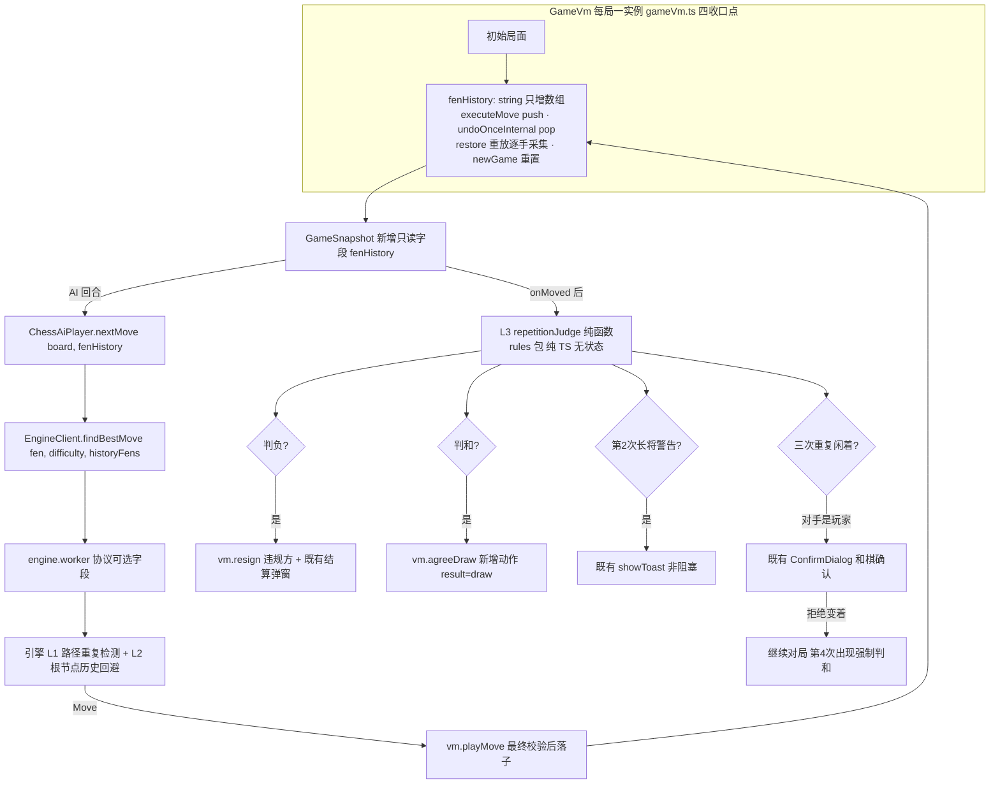
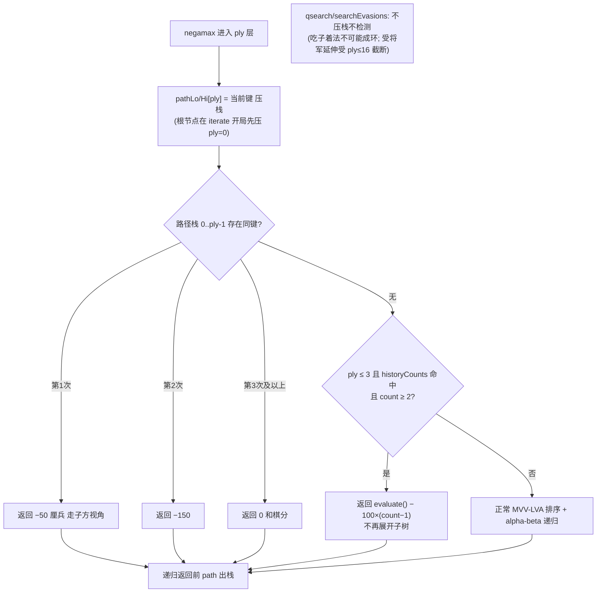
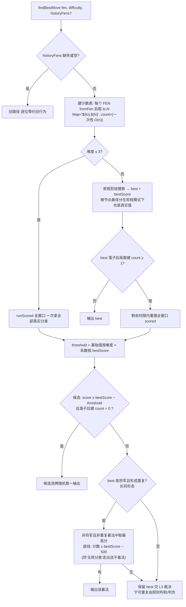

# 内置 AI 重复变招三层递进优化——最终设计（T3.5~T3.10）

> 状态：已评审定案（DR-018 / DR-019，见 decision_log.md）。本文档取代
> `built-in-ai-move-repetition-optimization-design.md`（草稿已移入 tmp/，不入库）。
> 前置审查结论已并入本稿：原草稿与代码库的脱节项（难度 1-7 错位、Zobrist 不存在、
> 转置表不存在、页面侧算哈希双实现等）均已按代码实况重设计。

## 0. 问题定义与决策摘要

**要解决的问题**（两个域，方案同时覆盖）：
- **局内循环**：AI 与对手来回走出重复局面；搜索把长将循环线误评为有利路线而主动选择重复。
- **规则判罚**：真实对局缺少长将判负与重复局面判和（02 §6 缺口，用户决策本期引入）。

**已定决策**：
- 决策 1 = C：全量方案 L1+L2+L3（长将判负 + 重复判和；**长捉 v1 不做**，见 §5.4）。
- 决策 2 = A：Zobrist 采用 hi/lo 双 32 位 + 固定种子 PRNG（拒绝 BigInt）。
- 决策 3 = A：本文档为唯一事实源，挂接 02/03/08/09/11/README。
- **AGENTS.md 同步修订**："02 §6 规则缺口本期不实现"改为"长将判负、重复局面判和按
  DR-018 实现；长捉与自然限着仍不实现"。
- **05 §2 提示词循环警示文本逐字不动**（铁律 #2）：L3 落地后"长将判负、重复局面
  被视为无效"从预告性表述变为真实规则，无需联动；"长捉判负"一句与未实现的长捉仍有
  出入，在 DR-018 记录，不改文本。

**兼容性铁律**：`historyFens` 不传时引擎行为与现版本**逐位一致**——289 个既有测试与
Dart 金标准对拍口径（09 §2.2）零改动保留。03 文档 L4"与 Dart 1:1 对拍"以
"受控偏差、默认关闭"方式成立。

## 1. 总体架构与数据流

核心原则：
1. **局面键单一事实源在引擎/规则包内**——页面只传它已有的 FEN 序列，不做哈希。
2. **L3 无状态纯函数** `f(fenHistory)`——悔棋/读档/新局回滚问题被设计消解，
   不存在可被污染的增量计数器。



## 2. L0：Zobrist 哈希（`src/packages/engine/zobrist.ts` 新文件，纯 TS）

- **键**：64 位 = `hashLo` + `hashHi` 两个 32 位整数（JS number 位运算安全域内；
  BigInt 逐节点分配在热路径不可接受，故弃）。
- **表**：两张 `Int32Array`（Lo/Hi），索引 `(pieceCode+7)*90+sq`——`data[sq]` 的带符号
  编码 ∈ −7..7 直接做索引（15 种棋子 × 90 格 = 1350 项），无需导出模块私有的
  `KIND_CODE`；另有一组"先手方"键，每次换手异或。
- **随机数**：固定种子的 xorshift32，模块加载时惰性初始化——键序列跨进程确定，可快照。
- **挂点**：`EngineBoard` 增加私有 `hashLo/hashHi`；`fromFen` 全量重建；
  `applyMove`/`undoMove` 严格互逆（engineBoard.ts:204-225 已证实），增量更新对称异或，
  undo 用同一组 (from,to,mover,captured) 逆序同式异或（异或自逆），无需额外撤销栈。

```mermaid
flowchart TD
    A[模块加载: 固定种子 xorshift32<br/>填 ZobristLo/Hi 两张 Int32Array<br/>索引=(pieceCode+7)*90+sq + 先手方键] --> B[fromFen: 逐格全量异或<br/>按 isRedTurn 异或先手方键]
    B --> C[applyMove]
    C --> D["mover@from 异或出 · captured@to 异或出(若有)<br/>mover@to 异或入 · 先手方键异或翻转"]
    D --> E[搜索热路径: O(1) 读 hashLo/hashHi]
    E --> F[undoMove: 同式逆序异或 + 先手方键翻转]
    F -.一致性验证.-> G[测试: 随机对局每步<br/>增量键 === fromFen(当前FEN) 重建键]
```

## 3. L1：搜索内重复检测（`search.ts`）

`SearchConfig` 增加可选 `historyCounts?: Map<string, number>`（键 `${lo},${hi}`，
由 chessAi 从 historyFens 一次性构建）。`undefined` → 零开销、旧行为。
路径栈为 `pathLo/pathHi: Int32Array(MAX_PLY)`，按 ply 下标复用 `moveBufs` 风格，
每节点线性回扫 ≤24×2 次 Int32 比较。



设计要点：
- 命中即**剪枝返回**，不展开子树——重复线反而省节点。
- 负分阶梯（−50/−150）从走子方视角惩罚"主动走成重复"，把搜索从循环线推开；
  第 3 次起按和棋分 0 收口。量纲与现有 `evaluate()` 厘兵制一致。
- 全局历史检查**仅在 ply≤3** 且 **count≥2** 才罚（真实重复威胁），count=1 不罚
  （避免误伤正常巡回运子）；深层节点只查路径内重复，防止棋力劣化。
- 悔棋/取消路径无需处理：搜索中断时棋盘随实例废弃（既有语义，DR-009）。

## 4. L2：根节点历史回避（`chessAi.ts` findBestMove）

`FindBestMoveOptions` 增加可选 `historyFens?: readonly string[]`（从初始局面到当前
局面的逐手 FEN，含轮走方）。**参谋接口 `findBestMoveEx`/`evaluateMove` 一律不接受
该参数**（03 §5.1 零随机/可复现铁律不动）。

阈值重锚到实际难度 1-5（chessAi.ts:18-24）：

| 难度 | 回避阈值基础值 | 搜索策略 |
|---|---|---|
| 1-2 | 200 厘兵 | 直接全窗口 scored（原 randomness>0 已是全窗口，深度浅成本低） |
| 3 | 100 厘兵 | 直接全窗口 scored（深度 4，成本可忽略） |
| 4 | 50 厘兵 | 两阶段：先常规剪枝搜索 |
| 5 | 30 厘兵 | 两阶段（深度 6，保住根剪枝收益） |

优劣势系数：`bestScore > +200` → 阈值 ×0.5（优势求变）；`bestScore < −200` → ×2.0
（劣势可重复求和，落败方靠重复求和为规则内合法策略）。



设计要点：
- 两阶段只在"最佳着法真的命中历史"这一罕见路径上才付出全窗口重搜成本——修正
  原草稿未计价的根剪枝损失（全窗口下高难度根节点失去剪枝，节点数可放大数倍），
  使"整体损耗 <2%"量级可信（验收：基准 FEN 集 nodeCount 差 ≤5%）。
- 底线 −500 厘兵（约半个车）修正原草稿"强制变着无视分差会送子"的缺陷；
  底线内无候选时保留原着交 L3，与"落败方靠重复求和合法"决策一致。
- 根节点全窗口模式下不调用 `pickRootMove` 的随机挑选——候选挑选完全由 L2 策略
  接管；难度 1-2 的既有 randomness 窗口与 L2 正交（L2 仅在命中历史时介入）。

## 5. L3：规则裁决层（`src/packages/rules/repetitionJudge.ts` 新文件，纯 TS）

**无状态设计**：每次真实落子后由页面 hook 以完整 `fenHistory` 调用，内部用
`Map<fen, 出现次数>` 现算（n≤数百，微秒级）。**悔棋/读档/newGame 不需要任何配套
回滚逻辑**——原草稿"historyKeys 栈与 moveHistory 一一对应同步"的整节问题被设计消解。

将军归责从 fenHistory 推导：第 i 手是将军 ⇔ `fenHistory[i+1]` 局面下走子方对手被
`Board.isCheck` 判将，逐手缓存（一次调用内）。

### 5.1 裁决 API

```ts
type RepetitionVerdict =
  | { type: 'perpetualCheckWarning'; side: Side }   // k=2 单方全程将军
  | { type: 'perpetualCheckLoss'; side: Side }      // k=3 单方全程将军 → 判负
  | { type: 'bothPerpetualCheckDraw' }              // k=3 双方全程将军 → 不变作和
  | { type: 'repetitionDraw' }                      // k=3 无人全程将军 → 判和(确认)
  | { type: 'forcedRepetitionDraw' }                // k=4 玩家曾拒绝 → 强制判和
function judgeRepetition(fenHistory: readonly string[]): RepetitionVerdict | null
```

### 5.2 裁决流程

```mermaid
flowchart TD
    M["每次真实落子后 hook 调用<br/>judgeRepetition(fenHistory) 无状态重算"] --> C{当前局面出现次数 k}
    C -->|k=1| OK[正常继续]
    C -->|k=2| W1{最近一环(两次出现间着法)<br/>单方全程将军?}
    W1 -->|是| W2["长将警告: showToast 非阻塞<br/>'X方连续将军重复, 再次将判负'"]
    W1 -->|否| OK2[正常继续]
    C -->|k=3| J{环分类}
    J -->|单方全程将军| L["长将判负: vm.resign(违规方)<br/>复用既有结算弹窗"]
    J -->|双方全程将军| D1[不变作和: vm.agreeDraw]
    J -->|无人全程将军| D2["三次重复判和:<br/>对手是AI → 自动 agreeDraw<br/>对手是玩家 → ConfirmDialog<br/>'接受和棋' / '变着继续'"]
    C -->|k=4 玩家曾拒绝过| D3[强制判和 vm.agreeDraw]
```

### 5.3 范围裁决（v1）

- **只做**：长将判负 + 重复局面判和（含双方长将不变作和）。
- **不做长捉**：攻击/保护/兑献分辨复杂度接近小型静态分析引擎，误判直接判负；
  02 §6 与 DR-018 如实记录。
- **删除原草稿的"无解长将兜底"**（所有合法着法均为将军→直接判负）——真实棋规
  无此条，该场景自然触发三次重复裁决，发明规则会凭空改变胜负。

### 5.4 棋规近似声明

"同一局面第 2 次出现且该方每轮主动走子均为将军 → 警告；第 3 次 → 判负"是亚洲棋规
长将条款的近似实现（以局面重现计数 + 环内将军归责替代连续长将追踪），双打对单打
（长将对长捉）等复合情形不支持。此近似与 02 §6"重建时的决策项"定位一致。

## 6. 页面接线（四个对局页共用）

新 hook `src/renderer/features/board/useRepetitionJudge.ts`：
- 监听 `moveHistory` 增长 → `judgeRepetition(vm.current.fenHistory)` →
  按裁决类型驱动 toast / `ConfirmDialog`（复用 sidePanel 现成组件与
  `resultDialogShownRef` 防重入模式）/ `vm.resign` / `vm.agreeDraw`。
- 挂到 HumanVsAiPage、HumanVsHumanPage、HumanVsLlmPage、LlmVsLlmPage 四页；
  AI/LLM 为应对方时自动接受和棋，仅玩家有"变着继续"选项。
- `ChessAiPlayer.nextMove(board, history?)` 的空置参数 `_history` 改传 `fenHistory`。

存档格式 `{fen, moves}` **不变**（07 持久化兼容），restore 重放时逐手采集
fenHistory。VM 新增 `agreeDraw()`（写 `result:'draw'`，复用 resign 的终局收尾）；
`GameResult` 已含 `'draw'`，`ResultBanner`/状态栏/PGN/DB 文案均已支持，零改动。

## 7. 测试方案（09 §2 对齐，先写测试再实现）

| 测试文件 | 类型 | 内容 |
|---|---|---|
| `test/engine/zobrist.spec.ts` | 对拍 | 固定种子确定性快照；随机对局每步"增量键===fromFen 重建键"；apply/undo 往返键复原 |
| `test/engine/chessAi.spec.ts` 扩展 | 金标准+快照 | 构造长将循环局面断言 L1 避开；L2 命中历史时选替代着、阈值/系数各档；**不传 historyFens 时与既有金标准期望逐位一致**；参谋接口不受影响 |
| `test/engine/engineWorker.spec.ts` 扩展 | 协议 roundtrip | 带/不带 historyFens 的 payload；缺失字段向后兼容 |
| `test/rules/repetitionJudge.spec.ts` | 金标准 | 10 个手构场景：k=2 警告、k=3 长将判负/双方长将和/闲着和、k=4 强制和、悔棋后重算一致、将军归责各形态 |
| `test/stores/gameVm` 扩展 | 单测 | fenHistory 四收口点维护（落子/悔棋/restore/newGame） |
| 节点数回归 | 性能门 | 基准 FEN 集上开/关 L1 的 nodeCount 差 ≤5%；难度 5 应答 ≤7.5s 既有门不变 |

## 8. 任务拆解与提交序列

挂 11 手册 M3 表（引擎域语义归属），执行时序插在 M6 收尾后：

| 编号 | 任务 | 提交 |
|---|---|---|
| T3.5 | 本文档 + DR-018/019 + AGENTS/02/03/08/09/11/README 挂接 | docs(m3)，Decision: DR-018 |
| T3.6 | Zobrist（测试先行 → zobrist.ts + EngineBoard 集成） | test(m3) → feat(m3)，Decision: DR-019 |
| T3.7 | L1 搜索内重复检测（search.ts + 测试 + 节点数回归） | test(m3) → feat(m3) |
| T3.8 | L2 根节点回避（chessAi.ts + 协议透传 + VM fenHistory + ChessAiPlayer） | test(m3) → feat(m3) |
| T3.9 | L3 repetitionJudge（测试先行）+ gameVm.agreeDraw | test(m3) → feat(m3)，Decision: DR-018 |
| T3.10 | UI 四页接线 useRepetitionJudge（对照 08 防错清单手测） | feat(m3) |

每任务收尾 `npm run lint` + `npm test` 全绿。
